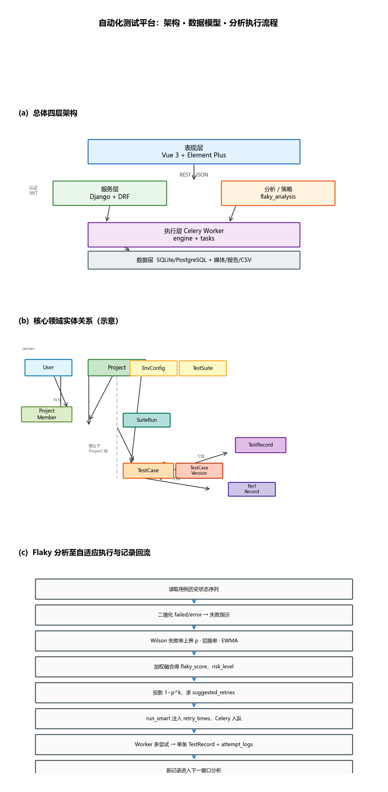
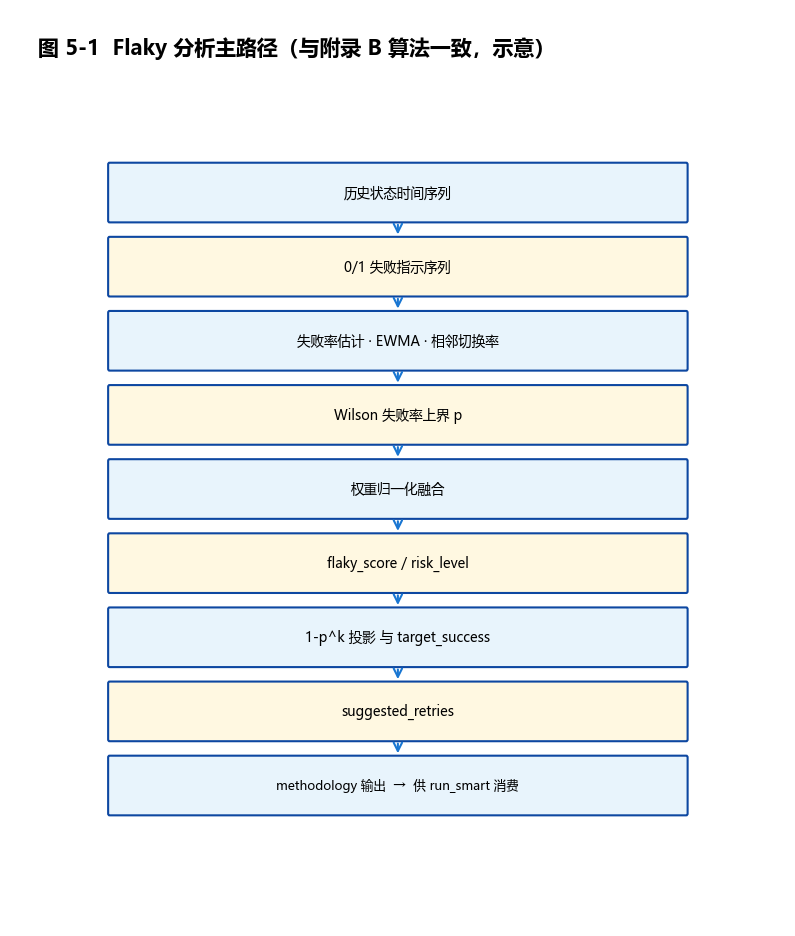
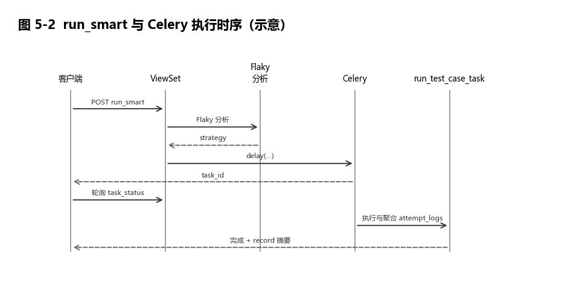

# 基于 Flaky 分析与自适应执行策略的自动化测试平台设计与实现

> 毕业设计论文
> 作者：<填写姓名> &nbsp;&nbsp; 学号：<填写学号> &nbsp;&nbsp; 指导教师：<填写姓名>  
> 学院 / 专业：<填写学院专业> &nbsp;&nbsp; 提交日期：2026 年 4 月

> 复现与数据说明：本文实验与实现以本仓库当前版本为依据，主要代码路径、脚本与数据归档见附录 D；正文只保留与论证直接相关的接口、数据和结果。策略批跑数据来自 `data/thesis_runs.csv` 与 `docs/artifacts/thesis_runs_20260424.csv`，表 6-3/6-4 可由 `scripts/thesis_runs_stats.py`、`scripts/export_experiment_summary_json.py` 及 `scripts/plot_thesis_ch6_figures.py` 复核生成。

---

## 摘要

**背景与问题。** 持续集成与高频回归场景下，Flaky 测试削弱结论可信度；固定重试或遇败即停往往缺乏与历史样本一致的统计依据，难以在「通过概率」与「时间成本」之间作可追溯取舍（文献[1,7,8] 等）。

**方法。** 本文在已有仓库上实现**三元融合** Flaky 风险分析：以 Wilson[5,9] 失败率**上界**、状态切换率与 EWMA[6] 失败趋势归一化融合为 `flaky_score`，在独立尝试假设下用 \(1-p^{k}\) 将上界失败率与目标成功率、最大尝试次数约束相联系，输出建议重试与 `methodology` 说明[5,6,9]。在此基础上设计 `run_smart`：服务端按分析结果将 `suggested_retries` 裁剪为实际 `retry_times` 并入队 Celery[13] 执行，与单条 `TestRecord` 样本语义一致。

**实现概览。** 平台采用前后端分离架构[11,12]：Django/DRF 提供资源与执行接口，Celery 承担异步用例/压测任务，Vue 3 工作台整合 HTTP、Selenium[17] UI、受控 SQL 与基于 **AST 生成** 的 Locust[16] 压测链路。质量评分 `quality_insight` 与 Flaky 分析/实验汇总 `experiment_summary` 在接口上相互独立[7,8]。

**实验结果。** 在固定环境（**表 6-1**）下，仓库自动测试通过 **94 个后端用例** 与 **2 个前端单测**；最新一次 8 个演示套件实际执行共 **25 条套件内用例**，结果为 **25/25 通过**，另 3 条论文实验用例单独执行均成功。策略批跑数据共 **96 条触发记录**（表 6-3）：稳定型 HTTP、波动型 UI 与高风险 HTTP 在本批窗口内观测成功率均为 **1.000**，平均尝试次数均为 **1.00**；Locust 压测入口也产生 `finished` 状态记录与 CSV 产物。由于本批未复现明显失败波动，本文将策略实验结论限定为“闭环可运行、统计投影可复核”，不外推为自适应策略在所有场景下显著优于固定重试。

**结论。** 本文实现了可部署的统一测试平台与可复核的分析—决策—执行闭环；量化结论以**表 6-3/6-4** 的实测、投影分列及第 6.7 节威胁分析为边界。

**关键词：** 自动化测试平台；Flaky 测试；自适应执行策略；Wilson 区间；统计风险分析；测试资产复用


---

## 目录

- 第1章 绪论
- 第2章 关键技术与相关研究综述
- 第3章 系统需求分析
- 第4章 系统总体设计
- 第5章 核心功能实现
- 第6章 系统测试与结果分析
- 第7章 总结与展望
- 致谢
- 参考文献
- 附录 A：主要 API 清单
- 附录 B：关键算法伪代码
- 附录 C：Flaky 相关环境变量（与 `core/settings.py` 一致）
- 附录 D：与仓库实现对照的复现要点

---
# 第1章 绪论
## 1.1 研究背景与问题提出

持续集成与持续交付已经成为软件工程实践中的主流研发范式。研发团队在代码合并后通过自动化流水线触发测试任务，以尽可能缩短缺陷发现时间并降低回归成本。在这一模式下，测试结果不再只是质量部门的参考信息，而是直接影响发布节奏与分支治理策略的关键信号。由于流水线执行频率高、反馈周期短，测试结论的一致性与可解释性成为研发组织决策的基础条件。国内在持续集成测试用例集优化、面向持续集成的回归测试约简、静态回归用例集构建以及强化学习驱动的测试策略（类集成序列、路径覆盖等）等方面已形成可检索的期刊型研究[19,20,21,22,23,24]；本文关注的「流水线高频执行 + 可解释风险估计」可与之并列阅读。

然而，实际工程中普遍存在 Flaky Test 现象，即同一测试用例在代码与环境未发生实质变化时，仍可能出现“本次失败、下次通过”的随机波动。该问题并非单纯的偶发噪声，而是会系统性削弱团队对自动化测试结论的信任；相关实证、检测框架、开发者调研与多声部综述对成因分类、影响与治理路径已有系统归纳[1,2,3,4,7,8]。当失败结果无法区分“真实缺陷”与“执行波动”时，开发人员往往采用经验性绕行策略，例如手工重跑、忽略告警或延后修复。由于这些策略缺乏统计依据，测试体系会逐步从“质量门禁”退化为“流程负担”，最终导致 CI/CD 的反馈闭环失真。对大规模仓库与 IDE 使用行为的分析亦显示，测试不稳定性在工程数据中可观测、且与开发者的测试习惯相互交织[4,10]。

从现有工程实践看，最常见的应对方式是固定次数重试，即为失败用例设置统一的 `retry_times`。该策略在局部场景中能够提高一次执行的通过概率，但无法回答“该用例当前稳定性如何”这一核心问题。其根本原因在于：固定重试只改变执行动作，不建模失败风险。若不考虑样本规模、失败序列的时序特征与波动结构，仅以单次结果决定重试次数，会导致两类偏差：其一，小样本下失败率估计过于乐观或悲观；其二，无法识别“近期抖动加剧”这类趋势性风险。

本研究在代码实现中将上述问题转化为可计算的稳定性评估任务。`backend/api/flaky_analysis.py` 通过对历史执行状态序列进行统计建模，引入 Wilson 失败率上界[5,9]、状态切换率与 EWMA 失败趋势[6] 三个互补指标，并输出 `flaky_score`、`risk_level` 与 `suggested_retries` 等决策参数。这里的处理原则是：重试次数不再只由经验阈值指定，而是先估计风险，再把估计结果交给执行层使用。进一步地，本系统在 `compute_flaky_analysis_from_statuses` 中将 `target_success` 与 `max_attempts` 纳入统一投影框架，利用“至少一次成功概率”近似建立策略选择依据，使执行决策从“固定动作”转向“数据解释 + 目标约束”的可复现过程。

基于上述分析，本文关注的问题是：在**与持续交付类似的「高频率、可审计」**执行需求下，如何构建一个同时覆盖 HTTP、UI、（受控）数据库与性能测试的统一平台，并在平台层提供可解释、可配置、可复现实验验证的 Flaky 治理机制，使自动化测试结论重新具备工程可信度。需要说明的是：当前实现以 **Web 端触发的任务队列（Celery）** 为主，与 Jenkins 等流水线的**插件式集成、触发策略与制品联动**未在仓库中展开；本文在绪论与需求章节将其作为**可类比问题域**来表述，第 3～5 章的边界以「平台已交付能力」为准。

## 1.2 研究目的与意义

针对测试资产分散、执行链路割裂与稳定性评估不足等现实问题，本文以平台化建设为切入点，设计并实现一个面向中小规模研发团队的自动化测试系统。该系统在后端采用 Django/DRF 组织领域模型与接口[11,12]，在执行层通过 Celery 承载异步任务[13]，在前端以 Vue 3[14] 构建统一工作台，覆盖“资产管理—执行调度—结果分析—策略优化”流程。本文的直接目标不是叠加更多测试工具，而是建立跨测试类型的一致语义，使功能测试、UI 自动化与性能压测能够共享项目、环境、变量与历史记录，从而降低维护成本并提升结果可追溯性。

从工程实现看，本系统整合了三类能力。第一，统一执行能力：`backend/api/engine.py` 支持 HTTP、Selenium UI 步骤[17] 与**对绑定环境中 SQLite 的受控 SQL 查询/断言**混合编排（SQL 在引擎层有长度、关键字与路径白名单等约束，见第 5 章与实现），与摘要中「Database」表述一致，并降低多工具切换带来的配置漂移。第二，异步与可观测能力：`backend/api/tasks.py` 将单次触发下的多次尝试聚合写入 `TestRecord.attempt_logs`，保证样本语义一致，避免把重试过程误记为独立样本。第三，性能复用能力：`backend/api/locust_codegen.py` 基于 AST 生成 Locust[16] 脚本，使功能测试资产能够直接转化为压测资产，减少手工脚本维护负担。

在方法设计上，本文强调“测试结论可信度”这一可量化目标。传统失败率在小样本条件下波动显著，难以直接用于策略决策。为此，本文引入 Wilson 区间上界[5,9] 作为保守估计，控制小样本乐观偏差；引入状态切换率描述成败抖动强度；引入 EWMA[6] 强化近期失败趋势表征。三者融合后形成可解释风险分，并通过投影函数将 `target_success` / `max_attempts` 约束下的建议重试次数写回执行层，使“为何建议重试 n 次”可与 `methodology` 中的假设、权重一并核对。

系统在 JSON 中保留 `methodology` 字段；**研究结论的适用范围、相关性与外推限制** 集中在第 **6.7** 节与第 **7.2** 节讨论，前序章节仅作必要提示，不重复铺陈。

## 1.3 本文主要工作与创新点

围绕上述目标，本文完成了以下主要工作，并在三个方向上形成**可复查、可与代码对应**的贡献（本文不将工业级多租户、全平台 A/B 在线对照等未在仓库中实现的能力纳入表述范围）。本文的创新点定位为**工程化与可解释策略的落地**：将 Wilson/切换率/EWMA 等**既有统计工具**在短窗口、有界投影假设下**接入**可运行平台与 `methodology` 契约，**非**提出全新基础算法理论；与强化学习/用例重排等路线在问题设定上**明确划界**（第 2.5、5.5 节）。

第一，本文构建了基于 Wilson 统计量[5,9] 与 EWMA[6] 的 Flaky 稳定性评估模型，**面向短窗口历史状态序列**与可配置的融合权重。具体而言，本研究在 `backend/api/flaky_analysis.py` 中实现了 `compute_flaky_analysis_from_statuses`：先基于历史状态序列计算 Wilson 失败率上界，再计算状态切换率与 EWMA 失败趋势，通过权重归一化融合得到 `flaky_score`。模型同时输出样本量置信提示、风险等级与投影曲线，解决了“只有失败率、没有可信度”的表达缺陷。与仅看通过率的做法相比，该模型能够在样本较少或序列波动明显时给出更审慎的判断；其**独立同分布**等假设见 `methodology` 与第 5.4 节，应在强相关失败或环境突变场合适度下调结论强度。

第二，本文实现了 `run_smart` 自适应重试策略，并完成从分析到执行的落地。在 `backend/api/views_case.py` 中，`run_smart` 接口读取目标成功率与最大尝试约束，调用 Flaky 分析得到 `suggested_retries`，再将策略参数注入 `run_test_case_task.delay(...)`。该机制使重试次数由历史稳定性动态决定，而非固定配置；且受平台对单次触发的**重试上界**与接口入参范围约束（与第 5.5.1 节一致）。执行结束后，新样本继续进入 `TestRecord`，反向更新后续分析结果，形成“历史数据—策略生成—任务执行—数据回流”的迭代流程。

第三，本文提出并实现了基于 AST 解析的**功能 HTTP 侧**异构测试资产向 Locust 的复用机制。`backend/api/locust_codegen.py` 对功能用例中的 HTTP 步骤进行结构化抽取，并通过 Python AST 构造 Locust 脚本，避免字符串拼接带来的语义歧义与注入风险。该机制使同一业务请求定义可同时服务于功能正确性验证与性能压测场景，降低“功能脚本与压测脚本双轨维护”问题；**非 HTTP 用例的压测入口限制**以工程实现与第 5.6.2 节说明为准。结合 `views_case.py` 的压测任务入口与 `views_records_perf.py` 的 CSV 解析，本研究实现了从用例定义到性能报告展示的完整链路。

除上述工作外，本文还在系统安全与治理方面完成了配套实现，包括 JWT 鉴权与权限隔离[11,12]、SSRF 边界校验[18]、敏感字段加密脱敏、审计日志追踪等。这些实现为在中小团队、教学与课程设计场景下可运行、可说明的平台提供基础条件。

## 1.4 论文组织结构

全文共七章，各章安排如下。

第1章为绪论，阐述研究背景、问题来源、研究目标与创新点，明确本文的研究边界与核心贡献。第2章为关键技术与相关研究综述，介绍 Django/DRF、JWT、Selenium、Locust、Flaky 统计方法等技术基础，并说明各技术在本系统中的作用。第3章为系统需求分析，从功能需求与非功能需求两方面给出平台建设目标，明确用户角色、业务流程与质量约束。第4章为系统总体设计，给出系统架构、模块划分、数据模型、接口设计与安全机制，并说明可扩展方向。第5章为核心功能实现，重点展开 Flaky 分析模型、`run_smart` 自适应策略、统一执行引擎与 AST 脚本生成的实现细节。第6章为系统测试与结果分析，围绕功能正确性、安全性与策略有效性进行实验验证，并对结果进行统计解读与威胁分析。第7章为总结与展望，归纳本文工作价值、现阶段不足与后续研究路径；致谢、参考文献与附录位于其后。

通过上述结构安排，正文按“问题提出—方法构建—系统实现—实验验证—总结提升”的顺序展开，使平台工程实践与方法研究结论能够相互对应。

---

# 第2章 关键技术与相关研究综述

## 2.1 Django + DRF 开发体系

本系统的核心目标是将分散的测试活动组织为可管理、可追踪、可审计的统一流程。针对这一目标，本文采用 Django + DRF 的分层开发体系[11,12]，并以 Model、Serializer、ViewSet 的协同关系构建测试资产生命周期。该体系的优势不在于框架本身的通用能力，而在于它能够把“业务实体约束”“接口输入校验”“访问控制与动作编排”明确拆分，从而降低测试平台在扩展过程中的耦合风险。

在数据层，`backend/api/models.py` 将测试域拆解为 Project、EnvConfig、TestCase、TestRecord、TestSuite、SuiteRun、PerfRecord 等实体。该建模方式使资产关系具备稳定边界：Project 负责归属与权限，TestCase 负责步骤定义，TestRecord 负责执行事实，PerfRecord 负责性能实验产物。由于实体语义清晰，后续统计与审计可以直接基于模型关系完成，不需要在接口层重复推断上下文。

在校验层，`backend/api/serializers.py` 通过 Serializer 承担输入约束与安全过滤职责。例如，`TestCaseSerializer` 对步骤结构、HTTP 方法、UI 动作合法性进行结构化校验；`EnvConfigSerializer` 对 `db_config` 字段进行白名单约束，并结合 JSON 深度、节点数量、字符串长度限制，抑制异常输入对系统稳定性的冲击。该设计使“数据是否可入库”由统一规则决定，避免在多个接口中复制散落的 if/else 校验逻辑。与第 1.2 节、摘要保持一致：用例在实现上还支持在 `engine.py` 中对**绑定环境内 SQLite** 的受控 SQL 查询/断言，并与 HTTP、UI 步混编；其安全边界与执行语义以第 5 章与代码为准，本节不展开。

在控制层，`backend/api/views_core.py`、`views_case.py`、`views_suite.py`、`views_records_perf.py` 以 ViewSet 组织资源行为，配合 `query_utils.apply_project_access_filter` 统一执行项目级权限过滤。由此，Project、Case、Record 不仅在数据库中具有关联关系，也在接口语义上形成一致访问边界。对于测试平台而言，这一一致性直接影响结论可信度：若权限边界不清晰，统计样本将混入无关项目数据，导致分析结论失真。

因此，Django + DRF 在本系统中主要承担两项作用：一是通过分层职责隔离，使测试资产管理从脚本堆叠转为可验证的工程系统；二是为后续 Flaky 分析、自适应策略与性能复用提供稳定的数据底座。此外，仓库在 `api/urls.py` 中通过 drf-spectacular 提供 OpenAPI 3.0 的 `/api/schema/` 及 Swagger/Redoc 浏览入口，利于接口自描述与系统演示。

与本文第四章「表现层」相对应，仓库前端为 **Vue 3 + Vite** 工程[14]，UI 组件库为 **Element Plus**[15]，压测结果可视化使用 **ECharts**（见 `frontend/package.json` 与 `PerfView.vue` 等；ECharts 为前端依赖、未单列入参考文献，与业界常见写法一致），与后端 REST 接口通过 JSON 协作，实现典型前后端分离形态。

## 2.2 JWT 鉴权与会话续期

前后端分离架构下，认证需要同时保证接口身份边界与日常操作少被打断。本文采用 **Access/Refresh 双令牌** 机制，以 **SimpleJWT 与 DRF 集成** 为技术锚点[11,12]：在 `settings` 中配置生命周期、刷新后黑名单等策略；在 `api/urls` 中挂载登录、刷新、注册等路由；对登录、刷新、注册等敏感入口使用**限流**作用域，抑制暴力尝试与刷新生成。

**原理层面** 关心的是：短生命周期 Access 用于业务鉴权，较长生命周期的 Refresh 仅用于续期；续期时轮换并作废旧 refresh，缩短凭据泄露后的有效窗口[11,12]。

**与第五章的分工**：第二章不展开类名与具体 throttle 作用域；前端如何用 `apiFetch`、401 时刷新与 **`refreshing` Promise 锁** 等实现细节，放在第 5.1.2 节，与「避免并发刷新竞态」的工程结论对应，避免与绪论/综述重复。

该机制把测试结论与具体用户身份关联起来，减少「认证态漂移」对任务轮询与报告查看的影响。

## 2.3 Selenium UI 自动化技术

UI 自动化的本质是以程序化方式驱动浏览器完成用户行为，并验证页面状态是否符合预期。Selenium WebDriver[17] 提供了“客户端脚本—浏览器驱动—浏览器实例”的控制链路，测试代码不直接操作 DOM 内存，而是通过驱动协议向真实浏览器发送动作指令。因此，WebDriver 更接近真实用户路径，适用于验证交互流程、元素可见性与页面行为一致性。

本系统在 `backend/api/engine.py` 中将 UI 动作抽象为 `open`、`click`、`input`、`wait_visible`、`sleep` 等原子步骤，并与 HTTP 步骤纳入同一执行引擎。该抽象方式使 UI 自动化不再独立于业务用例之外，而是成为统一步骤序列的一部分，便于在同一场景下表达“先调接口准备数据，再执行页面操作，再做接口校验”的混合流程。

页面异步加载是 UI 测试不稳定的主要来源。若脚本在元素尚未可交互时立即点击，测试将出现偶发失败。针对这一问题，本系统在执行层引入显式等待机制：通过 `WebDriverWait` 与可见性条件判断控制动作时机，减少由前端渲染延迟造成的误报。此外，执行引擎在失败路径中于内存中保留 PNG 截图数据（`TestEngine.last_screenshot`），由 `tasks.py` 将其写入 `TestRecord.screenshot` 文件字段，用于复盘失败现场。显式等待解决“何时执行动作”的问题，截图转存解决“失败后如何定位”的问题，两者共同提升 UI 测试的可解释性。

因此，Selenium 在本系统中不只是“自动点击页面”的工具；等待机制与截图留存共同把 UI 执行结果纳入可审计、可复盘的记录体系。

## 2.4 Locust 性能测试与脚本自动生成

性能测试关注系统在并发负载下的吞吐、时延与错误率表现。Locust[16] 采用事件驱动与协程并发模型，可在较低资源开销下模拟大量虚拟用户，适合快速构建面向 HTTP 服务的压测场景。与多线程模型相比，协程并发在 I/O 密集任务中更易扩展，并能以较清晰的任务函数表达负载行为。

本系统将性能测试定位为功能测试资产的延伸，而非独立体系。`backend/api/locust_codegen.py` 从功能用例中提取 HTTP 步骤，归一化 method、target、headers、body 等请求规格，再通过 Python AST 构造 Locust 脚本。这样做有两点好处：第一，减少重复建模成本，避免“功能脚本更新后压测脚本滞后”造成语义漂移；第二，AST 生成方式较字符串拼接更可控，能够在代码层明确字面量边界，降低拼接错误与注入风险。

在运行链路上，`views_case.py` 负责压测任务创建与参数校验，`tasks.py` 依托 Celery 任务队列[13]完成异步执行与状态收敛，`views_records_perf.py` 负责 CSV 解析与摘要指标输出，前端 `PerfView.vue` 负责可视化展示。由此，Locust 与平台中的用例定义、任务状态和结果报告连接起来，不再是孤立的压测脚本入口。

从论文结构看，本节为第五章实现细节提供理论铺垫：同构业务语义如何跨测试类型复用，以及为什么采用 AST 生成可提升资产一致性与安全性。

## 2.5 Flaky 检测的统计学基础

Flaky 现象、成因、检测框架与工程对策在实证研究与综述文献中已有系统梳理[1,2,3,4,7,8]；**本节不重复**该主题的全貌，而是从**统计估计与可执行重试**角度给出本文所用方法的理论锚点。Flaky 治理的关键不是“是否重试”，而是“在不确定性条件下如何估计风险并作出可解释决策”。为此，本文采用 Wilson 区间与 EWMA 两类统计工具，分别解决“小样本估计偏差”与“趋势变化捕捉”问题。

首先，Wilson Score Interval 相比简单通过率具有更稳健的小样本表现[5]。简单通过率本质是点估计，在样本量较小时方差较大，容易因为少数观测产生过度乐观或悲观判断。当代关于二项比例区间估计的综述性研究系统比较了多种构造方式，并指出在中小样本下**Wilson/score 型区间**较常见「标准正态近似（Wald）」区间在覆盖上更稳[5,9]；Wilson 区间通过将二项分布估计转换为区间形式，引入置信系数修正中心与边界，使估计在极端样本条件下更加保守。本文在 `flaky_analysis.py` 中采用失败率**上界**作为风险输入，并非追求“最准确均值”，而是面向工程决策强调“保守可控”。该选择符合测试门禁语境：在代价不对称条件下，低估风险通常比高估风险更具破坏性。

其次，EWMA（指数加权移动平均）用于捕捉稳定性趋势变化[6]。与普通滑动平均对窗口内样本等权处理不同，EWMA 对近期样本赋予更高权重，因此能够更快反映“近期失败是否正在升高”。在测试场景中，失败模式常受环境波动、依赖服务抖动、数据时效性等因素影响，稳定性并非平稳序列。若只使用全量平均，近期风险会被历史数据稀释，导致策略调整滞后。本文在实现中将 EWMA 与状态切换率、Wilson 上界融合为 `flaky_score`，从而同时表征“总体风险水平”“序列抖动强度”与“近期趋势方向”。

在策略映射层面，系统进一步通过“至少一次成功概率投影”把风险估计连接到执行动作。该设计体现了统计方法的工程落地路径：从描述性指标转向可执行建议。换言之，统计学基础在本系统中的作用不是提供抽象理论装饰，而是直接决定 `suggested_retries` 的生成逻辑与可解释性。国内研究亦将强化学习用于持续集成测试优化、类集成测试序列与路径覆盖测试数据生成等方向[20,21,24]，在「以反馈驱动用例/序列选择」这一抽象层面与本文的统计量—策略映射可对照，但问题设定（本系统针对执行历史与 Flaky 风险，而非桩复杂度或路径覆盖）与实现路径并不相同，故不宜作直接方法迁移。

## 2.6 Django 信号机制（Signal）与系统演进关系

Django Signal[11] 的核心价值在于事件驱动解耦。其基本思想是：当模型或框架事件发生时，发送方只负责发布事件，接收方独立处理后续副作用，例如审计记录、通知推送、指标聚合等。该机制可以减少业务主路径中对“附加动作”的硬编码依赖，提升系统可扩展性。

对于测试平台而言，Signal 的典型应用场景包括：执行记录保存后自动触发审计、用例状态变更后触发通知、压测完成后触发指标聚合缓存更新。若这些动作全部写在 ViewSet 或任务函数中，随着功能扩展，主流程会逐步承担过多副作用逻辑，导致维护成本上升。

本系统当前采用的是 ViewSet + Celery 的显式编排模式，即在 `views_*` 与 `tasks.py` 中直接调用审计与任务绑定逻辑。这一模式的优点是路径清晰、调试直接，适合毕业设计阶段快速验证核心流程。其局限在于副作用耦合度较高，复用与迁移成本随需求增长而上升。

因此，本文在理论综述中引入 Signal，并不意味着当前实现已经信号化，而是提出可验证的演进方向：在保持现有接口语义不变的前提下，将“记录落库后的附加动作”逐步迁移到 `post_save` 等事件处理器，再配合 Celery 实现异步消费与幂等控制。该演进路径能够在不破坏现有功能的条件下改善模块边界，为后续系统工程化升级提供方法依据。

通过上述分析，第二章把关键技术原理与本系统的使用方式对应起来：平台化治理依赖分层架构，策略可信度依赖统计建模，工程可持续性依赖解耦与演进机制。

---

# 第3章 系统需求分析

## 3.1 业务目标与角色边界

在持续交付语境下，测试平台的首要目标不是“把测试跑起来”，而是“让测试结论能够被研发团队稳定采信”。现实痛点在于：测试资产散落在不同脚本与工具中，权限边界依赖人工约定，执行结果缺乏统一解释，导致研发、测试与管理角色对同一失败事件给出相互冲突的判断；**不稳定测试（Flaky）**对流程可信度的影响在实证与综述中已有系统讨论[1,7,8]。针对这一现状，本系统将业务目标定义为三点：第一，统一管理测试资产与执行记录；第二，提供可追踪、可授权的执行通道；第三，在结果层引入可解释的稳定性分析，使策略决策具备依据。国内在持续集成测试用例集优化、回归与静态用例集构建等方向的研究[19,22,23]，与上述「资产生命周期 + 可复现执行」需求在**问题域**上存在交集，但本文平台形态以**自研 Web 端队列执行**与**可解释统计策**为边界（见第 1.1 节），不在此重复展开产业流水线对比。

角色划分方面，本文将用户抽象为管理员与普通用户两类。管理员负责项目级配置与治理，普通用户负责在授权范围内执行、查看与分析。该边界在数据模型中具备明确落点：`Project.owner` 表示项目归属，`ProjectMember` 用于维护项目成员关系及生效状态；资源实体（如 `TestCase`、`TestSuite`、`TestRecord`）通过外键关联项目，实现“以项目为最小权限域”的访问控制。由此，系统需求并非简单的“有无登录”，而是要求资源访问遵循项目边界，避免跨项目数据混读。

这一角色模型对应的业务价值体现在两个层面。其一，治理层价值：管理员可集中维护项目、环境与成员，避免测试资产在多人协作下失控。其二，执行层价值：普通用户在可见边界内完成执行与分析，不会因权限漂移导致结果不可复现。换言之，角色边界需求本质上服务于“数据可信 + 结论可信”。

## 3.2 功能需求分析

### 3.2.1 测试资产管理需求

传统自动化实践把“用例脚本”作为唯一资产，忽略了环境、变量、版本与成员关系等上下文信息，导致脚本可运行但不可迁移。针对这一痛点，本系统将资产管理需求扩展为“项目—环境—用例—套件—记录”的全链条模型；**持续集成背景下测试用例集的组织与约简**在研究与综述中亦被反复强调[19,22,23]。

第一，系统需要支持项目与成员管理，使资产具备归属与协作语义。第二，系统需要支持用例版本化，确保关键回归场景可追溯、可回滚。第三，系统必须支持环境配置（EnvConfig）与变量管理，因为复杂测试场景往往依赖 base_url、鉴权令牌、数据库路径等运行上下文。若缺少环境层，测试将退化为硬编码脚本，难以在开发、测试、预发等多环境间复用。

此外，变量渲染能力属于刚性需求，而非体验优化。业务流程中的动态参数（如订单号、token、用户标识）必须在步骤执行时可注入、可提取、可传递，才能支撑真实链路验证。因此，资产管理不仅是 CRUD 操作集合，更是“可复用执行语义”的结构化承载。

### 3.2.2 执行引擎需求

研发场景中的回归流程通常跨越多个交互层：先通过 HTTP 接口准备测试数据，再在 UI 页面触发业务动作，最后回到接口或数据库验证结果一致性。若平台只支持单一执行类型，用户就需要在多工具之间手工拼接链路，带来高维护成本与高误差率。

因此，本系统提出混合编排需求：执行引擎必须支持 **HTTP 与基于 Selenium 的 UI 步骤[17]在同一用例中顺序协同**；并在统一后端进程内以 Django/DRF[11,12] 组织步骤调度与落库。该需求的业务价值在于把“真实业务流”映射为单一可执行工件，避免测试语义被工具边界切断。

同时，复杂场景要求执行前后具备数据准备与清理能力。若没有前置/后置动作，测试结果会被脏数据与环境残留干扰，导致可重复性下降。基于此，系统需要支持 `setup`/`teardown` SQL 执行，并对 SQL 语句和路径进行约束，保证数据可控与执行安全。该需求的核心不是“能跑 SQL”，而是“可在受控边界内稳定复现实验条件”。

### 3.2.3 Flaky 分析与自适应执行需求

在与持续集成类似的高频执行场景下，用户最难处理的问题不是单次失败，而是“失败是否代表真实质量风险”。固定重试策略无法区分“偶发抖动”与“稳定退化”[1,4,7,8]；工业界大样本与 IDE 行为研究亦表明不稳定测试与工程实践强相关[4,10]。因此用户需要一个能够解释**风险来源**的分析能力，而非仅重跑次数；统计上则对应于对失败率及序列特征的稳健描述与可执行映射[5,6,9]。

基于此，本系统将 Flaky 分析定义为核心需求：平台应面向历史执行序列输出 `flaky_score`、风险等级、建议重试次数与成功率投影，并暴露方法论说明[5,6,9]（`methodology` 字段）。用户看到的不是黑盒结论，而是可解释指标组合。若缺失该能力，`run_smart` 只会沦为“自动点重试”的封装，不具备决策价值。

进一步地，系统要求提供 `run_smart` 接口，将分析结果直接映射到执行参数，形成“分析—决策—执行”闭环。该需求对应的业务价值是：减少人工经验依赖，使重试策略从统一阈值转向按用例稳定性动态调整。对于团队管理者而言，这意味着失败处置流程可标准化；对于一线执行者而言，这意味着减少盲目重跑与等待成本。国内在持续集成测试优化与强化学习驱动策略等方向的研究[20,21,24]，主要面向**用例选排与序列生成**，与本文的**历史执行—统计量—重试**路径不同，但可作为**需求侧「智能化策略」**的对照阅读。

### 3.2.4 性能测试与资产复用需求

功能测试与性能测试长期割裂是测试平台常见痛点。实践中常见“功能用例在 A 系统维护，压测脚本在 B 系统重写”，造成双份资产、双份维护、双份偏差。针对这一问题，本系统提出“资产复用优先”的性能需求：应能够从既有功能用例直接派生压测任务，并复用同一业务请求语义，工具链上以 **Locust[16] 为执行内核**、**Celery[13] 为异步载体** 进行任务编排与结果回收。

这意味着平台不仅要能触发压测，还要能自动生成可执行脚本、异步管理任务状态并回收结果指标。用户的关键诉求是缩短从“功能验证通过”到“负载验证启动”的路径长度，以便在需求变更后快速评估性能影响。该需求的预期价值在于降低压测准备门槛，使性能验证成为常规回归流程的一部分，而非上线前临时动作。

### 3.2.5 辅助能力需求（审计、质量评分、OpenAPI/套件导出）

除核心执行与 Flaky/自适应主路径外，系统还需：**审计与可导出结果**（关键操作与执行留痕、报告 HTML/JSON、历史可查询），以满足复盘与基本合规；**可解释质量评分**（`GET quality_insight/`，与 Flaky 统计**相互独立**[7,8]：规则化设计分/可靠分/运维分，非机器学习模型，权重与实现见第 5.2.3、5.7 节）；**工程增值**（仅管理员**OpenAPI 批量导入**用例[11,12]、套件级 **Locust 脚本下载**[16]），缩短从规范到可跑资产的路径。后两类细节以第 4～5 章与附录 A 为准，本章仅确立需求存在与边界，避免与实现章节抢篇幅。

## 3.3 非功能需求分析

### 3.3.1 安全性需求

测试平台天然具有高风险输入特征：用户可配置 URL、SQL、变量与脚本参数。若缺乏安全约束，平台将成为攻击面扩散入口。基于这一现实，本系统在需求层明确三类安全要求。

第一，出站访问安全需求：平台必须具备 **SSRF 边界校验[18]** 能力，限制协议、主机与特殊网段访问，避免测试请求被用于探测内网或本地服务。第二，数据操作安全需求：SQL 执行必须受语句类型、关键字与路径范围约束，防止多语句注入、危险语句滥用与越界文件访问。第三，敏感信息保护需求：环境变量与用例变量中的密钥类字段必须加密存储、脱敏展示，并支持掩码更新[11,12]（`serializers` 中掩码/加密合并逻辑），避免在前端回显或日志中泄漏。

这些安全需求的共同目标是把“可执行能力”限制在“可控边界”内，确保平台在赋能测试效率的同时不引入新的安全债务。

### 3.3.2 可用性需求

可用性需求主要体现在长耗时任务与高频交互场景。由于用例执行、套件运行与压测任务存在明显执行时长差异，系统必须支持 **Celery[13] 异步调度**与**任务状态可查询**（`task_status` 等），以防止请求超时和页面阻塞。与此同时，平台需要具备重复提交抑制与状态收敛能力，避免用户误操作导致任务洪泛或记录失真。该需求的业务价值是保证“可持续操作体验”，使用户关注测试结论本身，而非任务调度细节。

### 3.3.3 可解释性需求

本研究将可解释性定义为关键非功能需求，而非附属展示能力。原因在于：当平台引入**基于 Wilson/EWMA 等统计量[5,6,9] 的策略决策**时，用户必须知道“建议从何而来”，否则算法输出无法进入工程流程[7,8]；**Flaky 研究综述亦强调**治理可解释与工具可观测[7,8]。基于该需求，系统不仅要输出 `flaky_score` 和 `suggested_retries`，还要提供 `methodology` 字段解释模型权重、假设与局限。

该需求的预期价值包括两方面：一，使策略**可质疑、可复现**；二，使估计与**结论强度** 的讨论有依据。**方法外推、强相关失敗等** 边界不在此展开，见第 **6.7** 节。

## 3.4 用例图与流程分析（文字化描述）

为便于后续绘制用例图与时序图，本文先给出核心闭环流程的文字化描述。

流程起点为“用例创建”。管理员在项目域内创建或维护用例，配置步骤、变量、环境与前后置动作，并将其纳入可执行资产集合。随后进入“自适应执行”阶段：普通用户或管理员触发 `run_smart`，系统读取该用例近期执行序列，按第 2.5 节与第 5.4 节所述方法计算 **Flaky 风险指标[5,6,9]** 并生成建议重试次数，再将策略参数注入 **Celery[13]** 异步执行任务。执行过程中，引擎按混合步骤完成 HTTP/UI 动作与必要 SQL 处理，最终写入**单条**聚合后的 `TestRecord` 与 `attempt_logs` 尝试明细（与第 1.2、2.1 节一致）。

流程终点不是“任务完成”，而是“结果回流”。新产生的记录会进入后续 Flaky 分析窗口，影响下一次策略建议[1,7,8]；用户可在前端查看风险分、`methodology` 说明、历史报告与策略对比（`experiment_summary`）结果，进而决定是否优化用例设计、调整环境或修改业务阈值。由此形成“用例创建—自适应执行—结果回流”的持续迭代闭环。

该闭环的业务价值在于把测试活动从单次任务提升为持续学习过程：系统不是静态执行器，而是能够基于历史证据不断修正执行策略的决策支持平台。

通过本章需求分析，本文完成了从现状痛点到需求定义再到业务价值的推导。后续章节将在此基础上展开系统设计与实现，验证这些需求如何被具体架构与模块机制满足。

---

# 第4章 系统总体设计

> 本章在第三章需求分析基础上，给出系统的结构化设计方案。写作目标不是罗列组件名称，而是回答三个问题：系统如何分层、模块如何协作、设计如何支撑“可执行 + 可解释 + 可治理”的平台目标。与第 3 章对应：需求中的可解释性、安全与异步约束，在本章分别落实为「`methodology` 响应契约」「出站与数据面防护设计」与「执行/压测异步链」；Flaky 相关统计与工程结论的文献脉络仍主要依据第 1～2 章与文献[1,5,6,7,8,9]。

## 4.1 总体架构设计

### 4.1.1 设计原则

本系统遵循四项架构原则：

1. **职责分离**：界面交互、业务编排、任务执行、数据存储分层处理；
2. **异步优先**：长耗时任务（执行/压测）不阻塞 API 请求线程；
3. **项目域隔离**：所有资源访问以项目为最小权限边界；
4. **可解释输出**：分析结论需附带方法依据，而非黑盒分数。

这四项原则直接对应论文核心诉求：工程可落地、结果可追溯、策略可复核。

### 4.1.2 四层架构模型

系统采用前后端分离的四层架构：

- **表现层（Vue 3）**：负责资产编辑、任务触发、状态轮询、结果可视化；
- **服务层（Django + DRF）**：负责认证鉴权、权限过滤、接口编排、分析输出；
- **执行层（Celery Worker）**：负责用例执行、套件执行、压测执行；
- **数据层（DB + Media）**：负责结构化数据持久化与报告/截图/CSV 产物存储。

该模型避免了“前端直连执行器”或“**在 API 线程内长时间阻塞等待**用例/压测结束”的反模式，保证在并发场景下接口延迟可控。**实现注记**：当开发环境开启 `CELERY_ALWAYS_EAGER`（见 `core/settings.py`）时，`.delay()` 可能在**同一进程**内同步执行，对外仍返回 `task_id` 与轮询契约，但**不**改变「分析在 View 中、执行在任务函数中」的职责划分；生产环境应使用独立 Worker 进程以体现本图所示并发边界。

### 4.1.3 关键链路时序（文字化）

以 `run_smart` 为典型路径，其顺序是：读历史 → `Flaky` 分析 → 确定 `retry_times` → 入队 → Worker 多尝试并聚合成单条 `TestRecord` → 前端 `task_status` 轮询 → 新结果进入下一分析窗口。与第 3.4 节「用例创建—执行—结果回流」同一闭环，此处不逐条展开；**细粒度时序**见第 5.5.2 节与**图 5-2**。

### 4.1.4 总体架构、领域关系与 Flaky/执行流程图

为与第 4.1.2、4.3.1、5.4～5.5 节文字描述对照，依据当前仓库 `backend/api/models.py` 与 `flaky_analysis` / `run_smart` 主路径，将**四层架构、核心 E-R 关系、自历史序列到 `TestRecord` 回流**合绘于**同一张**示意图中，便于在论文中按一页或跨页形式呈现。



**图 4-1 说明**

- **(a) 总体四层架构**：自顶向下为表现层（Vue 3 工作台）、服务层（Django + DRF，含 Flaky 等分析能力）、执行层（Celery 调用 `engine` / `tasks`）、数据与产物层（关系库及截图、压测 CSV 等），请求经 REST/JSON 下行，**执行与 HTTP 长耗时不阻塞** Web 进程；认证由 JWT 在边界完成（与第 2.2、5.1 节一致）。  
- **(b) 核心领域 E-R 示意**：`User` 与 `Project` 为**归属/成员**关系（`ProjectMember` 表达多对多）；《Project》在一域内**聚合** `EnvConfig`、`TestSuite`、`TestCase`；`TestCase` 产生 `TestCaseVersion`、`TestRecord`（1:N）、`PerfRecord`；`TestSuite` 产生 `SuiteRun`。图中略去定时任务、审计等次要实体，**仅突出项目域隔离与单条 `TestRecord` 语义**（与第 4.3.2 节、附录 D 一致）。若学院模板要求**规范 Chen 氏 E-R**，可据此图在 Visio 或 PowerDesigner 中重绘，不必改变关系含义。  
- **(c) Flaky 至自适应执行与回流**：对应 `compute_flaky_analysis_from_statuses` 与第 5.4.1 节：历史状态序列经二值化、Wilson 上界/切换率/EWMA 融合得 `flaky_score`（参数与假设见响应中 `methodology`[5,6,9]），再经 \(1-p^k\) 投影得建议重试；`run_smart` 将 `retry_times` 交 Celery[13]，多尝试**聚合**为一条 `TestRecord` 及 `attempt_logs`，新数据进入**下一窗口**分析，形成与第 4.1.3 节文字一致的闭合链路。该链路与「不稳定测试影响研发信任」的问题域表述[1,7,8]一致，但**不**声称本图已包含企业级流水线侧的全部角色与制品。

**制图说明**：图中文字由本仓库 `docs/images/gen_thesis_figures.py` 使用 Matplotlib 生成矢量布局后光栅为 PNG；若需矢量稿，可由同脚本导出 PDF/SVG，或据此在制图工具中重绘，图义保持 (a)～(c) 三分结构不变。

## 4.2 模块划分与职责边界

### 4.2.1 认证与权限模块

- 认证：JWT 双令牌（签发/刷新/过期控制）[11,12]；
- 授权：项目域过滤 + 管理员能力控制；
- 任务权限：任务状态查询按 owner 绑定。

该模块边界明确：认证模块只决定“你是谁”，项目过滤决定“你能看什么”。**叙述上**须与第 2.2 节一致：刷新黑名单、登录/注册限流等属于**横切安全能力**，不在此重复展开实现细节。

### 4.2.2 资产管理模块

资产管理覆盖 Project、EnvConfig、TestCase、TestSuite、TestCaseVersion。设计重点：

- 用例步骤结构化，支持 HTTP/UI 混合（UI 步骤由引擎内 Selenium 路径执行[17]）；
- 环境变量与数据库配置可复用；
- 套件通过 `ordered_case_ids` 有序用例 ID 列表表达业务流程；
- 版本快照保障变更可追溯。

该模块输出的是“可执行资产”，不是静态文档。

### 4.2.3 执行与调度模块

执行模块由 `engine.py + tasks.py` 构成，任务由 **Celery[13]** 从 Web 请求路径外调度：

- 引擎负责单次动作执行与步骤日志；
- 任务负责重试、聚合、状态转移与产物保存。

边界划分使引擎专注“怎么跑”，任务专注“跑多少次、如何落库”。

### 4.2.4 分析与策略模块

分析模块（`flaky_analysis.py`）负责 Flaky 指标计算[5,6,9]；**策略**由 `run_smart` 等接口将 `suggested_retries` 映射为 `retry_times` 入参。设计上二者松耦合：

- 分析纯函数可独立测试、与论文/附录对照复现；
- 策略接口仅消费分析输出，不重复实现统计逻辑（避免「接口里再手算一遍 Wilson」的重复与漂移）。

该划分降低了策略迭代时对执行链路的侵入。

### 4.2.5 报告与审计模块

- 报告：支持执行记录 HTML/JSON 导出、压测 CSV 聚合摘要；
- 审计：记录资源创建/更新/删除等关键操作。

该模块承担“证据留存”职责，是论文实验复现与问题定位的依据源。

## 4.3 数据模型设计

### 4.3.1 领域实体关系

核心关系为（**与图 4-1(b) 一致**）：

- Project 聚合 EnvConfig/TestCase/TestSuite；
- TestCase 关联 TestRecord/TestCaseVersion/PerfRecord；
- TestSuite 关联 SuiteRun。

这种聚合结构使统计口径天然按项目与用例分组，便于生成稳定实验样本。

### 4.3.2 执行记录语义设计

`TestRecord` 设计为“单次触发一条记录”，内部重试写入 `attempt_logs`。该语义具有两个工程优势：

1. 避免将重试次数误当样本数量；
2. 允许同一触发下保留尝试细节用于排障。

对 Flaky 分析而言，这一设计决定了统计对象是“业务触发事件”，而不是“底层重试动作”。

### 4.3.3 权限数据模型

Project 通过 `owner + ProjectMember(is_active)` 建立授权关系。所有执行与记录实体都通过项目外键继承访问边界。该设计使权限可在查询层统一处理，不需在每个业务函数重复判断。

## 4.4 接口体系：资源分层、异步契约与可解释分析

接口按**资源 CRUD**、**改变运行态的动作**、**只读/弱副作用查询** 三类组织；完整路径与说明见**附录 A**，本节只保留对论文复现和实现核对最关键的两点。

**（1）异步执行契约。** 用例/套件/压测等长耗时动作为「立即 `task_id` + `GET /api/task-status/{task_id}/` 轮询」[13,14]；**不**进入该链的动作包括：OpenAPI 同步导入、套件 Locust 附件下载等（与第 3.2.5 节、附录 A 一致）。  

**（2）可解释分析契约。** `flaky_insight` / `experiment_summary` 在返回指标分解[5,9] 与重试/投影[5,6,9] 的同时，统一附带 `methodology`；`GET` 上 `target_success`（0.80～0.99）与 `max_attempts`（1～4）为 **Query** 参数。`run_smart` 在**入队前**用同一 `compute_flaky_analysis_for_case` 核[5,6,9]，策略参数在 **POST JSON body** 中，与 `GET` 混用会导致复现偏差。

## 4.5 执行架构与任务状态机设计

### 4.5.1 用例执行状态机

用例执行状态包含：`running -> success/failed/error`。在重试场景下，最终状态由所有尝试结果聚合决定，`attempt_logs` 记录每次尝试的耗时与错误。

### 4.5.2 压测执行状态机

压测记录状态包含：`queued/running/finished/timeout/error`。系统通过定时收敛任务修正脏状态，避免前端长期显示“运行中”假象。

### 4.5.3 去重与幂等设计

压测入口在短时间窗口内对同参数任务做去重复用，降低重复点击导致的资源浪费。该设计本质上是“交互容错”，对平台稳定运行至关重要。

## 4.6 安全设计

### 4.6.1 出站请求边界（SSRF 防护）

执行引擎在发起外部请求前校验 URL 协议、主机、用户名密码段及解析地址，拒绝回环/内网/保留网段目标[18]。该设计防止平台被利用为内网探针；**需求—设计—实现** 对应关系见第 3.3.1 节与第 2 章对 OWASP/DRF 生态的说明[11,12,18]。

### 4.6.2 SQL 与文件路径安全

数据库执行限制多语句与危险关键字；SQLite 路径需通过规范化校验并限制在允许目录内，阻断越界访问（`engine.run_db_query` 等，见第 5 章与代码）。

### 4.6.3 敏感信息保护

变量与 `db_config` 等字段采用加密存储[11,12]（`serializers` 侧），读取时脱敏，更新时支持掩码合并，避免明文凭据在界面或日志中泄露。

### 4.6.4 访问节流与任务归属

认证入口限流[11,12]（`ScopedRateThrottle` 等，见第 2.2 节），`task_status` 按任务归属与 eager 模式规则校验[11,12]（见 `views.py` 与第 2 章），降低暴力访问与越权查询风险。

## 4.7 可解释性与实验可复现设计

### 4.7.1 可解释性设计

系统将 `methodology` 作为**正式 JSON 响应字段**（与 `flaky_insight` / `run_smart` 返回中的策略对象同源），使前端可展示版本号、**有效权重**、假设与局限[5,6,9]。该设计使策略建议具备可讨论性，而不是“模型说了算”，并与可解释性、治理类的软件工程讨论[7,8]在**工程形态**上衔接（**非**将本文与 ML 可解释性文献等同）。

### 4.7.2 复现性设计

实验复现依赖三项机制：

1. 用例版本快照（`TestCaseVersion` 等）；
2. 执行记录与尝试明细（`TestRecord` 单条聚合语义与 `attempt_logs`）；
3. 策略对比接口 `experiment_summary` 输出（与 `flaky_insight` 同分析核）。

通过这三项机制，论文中的实验表格可以回溯到具体输入资产与执行事实，并与第 6 章的测环境、威胁分析一节共同构成「**可复现叙事**」而非单次截图结论。

## 4.8 可扩展性设计与演进路线

当前实现采用 ViewSet 显式编排 + Celery 异步执行，适合毕业设计阶段快速验证。面向后续工程化，可沿三条路线演进：

1. **事件驱动演进**：将部分副作用迁移至 Django Signal + Celery，降低主流程耦合；
2. **策略模型演进**：在现有 Flaky 指标基础上加入更细粒度时序特征；
3. **可观测性演进**：增加链路追踪与统一监控面板，提升线上问题定位效率。

通过以上设计，本系统在当前阶段实现“可用、可解释、可治理”，并在架构边界上保留了可持续扩展空间。

---

# 第5章 核心功能实现

> 本章严格基于仓库现有实现展开，聚焦“可运行代码如何支撑论文方法论”。为便于实现核对，本章按“实现目标—关键流程—代码落点—工程价值”组织。**叙述边界**：不将未在仓库中实现的产业级功能（多租户、在线 A/B 等）写为“已完成”；统计与可解释性论述与文献[5,6,9]、Flaky 问题域[1,7,8] 及第 4.4、5.4.2 节**使用边界**一致。技术实现与产品文档的对应可参考文献[11,12,13,14,16,17,18] 等。

## 5.1 认证与权限控制实现

### 5.1.1 JWT 认证链路落地

后端在 `backend/core/settings.py` 中配置 `SIMPLE_JWT`[11,12]（`rest_framework_simplejwt` 与 DRF 集成），包含双令牌生命周期、刷新后黑名单等；具体视图类在 `api/views.py` 中对登录、刷新**封装了限流**[11,12]。该设计关键点是（与第 2.2 节原理段对应，不重复类名与路由表）：

1. Access Token 生命周期较短，用于日常接口鉴权；
2. Refresh Token 生命周期较长，仅用于续期；
3. 刷新后旧 Token 失效，降低凭据复用风险。

认证接口并非裸露入口。系统通过 `ScopedRateThrottle` 对登录、注册、刷新分别限流，避免凭据爆破与刷新洪泛。由此，认证能力不止“能登录”，而是“可在高频请求场景下保持安全边界”。

### 5.1.2 前端无感续期机制

前端统一请求层位于 `frontend/src/api.js`。`apiFetch` 的执行流程可概括为：

- 第一步：读取 Access Token 并注入 `Authorization` 头。
- 第二步：请求接口，若非 401 直接返回。
- 第三步：若返回 401，则调用 `refreshAccessToken` 使用 Refresh Token 换取新 Access Token。
- 第四步：刷新成功后自动重放原请求。

该实现通过 `refreshing` Promise 锁避免并发刷新竞态，使多个 401 同时出现时只发生一次刷新请求。该细节对任务轮询场景尤为重要：否则会出现“重复刷新—Token 覆盖—局部请求失败”的链式问题。

### 5.1.3 项目域权限隔离

权限核心不是用户角色字符串，而是“资源能否被正确过滤”。后端在 `query_utils.apply_project_access_filter` 中统一应用项目级访问约束：管理员全量可见，普通用户仅能访问 owner 或 active member 范围内资源。该过滤逻辑被项目、环境、用例、套件、记录等多个 ViewSet 复用，避免权限判断散落。

同时，`views.py` 中 `task_status` 结合 `task_tracker` 校验任务归属，防止用户查询他人任务状态；在 **Celery 同步直跑**且缓存无法跨进程写回 `task_tracker` 的本地调试场景下，代码**同时**检测 `settings.CELERY_TASK_ALWAYS_EAGER` 与 `settings.CELERY_ALWAYS_EAGER`（后者见 `core/settings.py` 中 `CELERY_ALWAYS_EAGER`），对「无归属但任务已就绪」的情形做**收紧式例外**，避免误伤合法轮询。生产环境推荐 Redis Worker + 正常归属绑定。该设计使“异步任务”也具备与资源一致的权限边界。

## 5.2 用例资产与版本管理实现

### 5.2.1 用例结构化建模

`TestCase` 模型定义了步骤、变量、标签、前后置 SQL 与状态字段。与传统脚本模式相比，结构化字段的优势在于：

- 可通过 Serializer 做输入校验；
- 可在前端以可视化方式编辑；
- 可在后端统一执行与分析。

`TestCaseSerializer` 对**步骤**做了强约束：`step.type` 必须是 `http` 或 `ui`（与执行引擎可解释分支一致[17]），HTTP 方法需在允许集合中，UI 动作与定位方式需合法。用例根部的 `setup_sql` / `teardown_sql` 为**用例级**数据准备/清理，不在 `steps[]` 内重复建模。这一层防止了“数据已入库但无法执行”的脏资产产生。

### 5.2.2 版本快照与回滚

`views_case.py` 在创建/更新后调用 `create_version` 写入 `TestCaseVersion`。快照包含标题、步骤、变量、状态等关键字段。回滚接口 `restore_version` 支持按版本号或版本 ID 恢复，并在恢复后自动生成新版本，形成“可回退且可追溯”的变更链。

该机制对论文实验复现非常关键：实验中若需回放某个策略版本，可通过版本快照恢复当时的用例定义，避免“当前脚本已改变，历史结果不可复现”。

### 5.2.3 可解释质量评分实现要点

`quality_insight` 在后端以**规则**统计实现（非 Flaky 模块 [5,6,9] 的区间模型）：分别计算设计分（HTTP 断言/capture/ UI `wait_visible` 等）、可靠性分（`case.records` 近 **20** 次，与代码 `order_by("-created_at")[:20]` 一致）与可运维分（标签、变量、近 10 次压测记录等），再按约 **0.45/0.40/0.15** 合成综合分并给 A/B/C/D 等级，同时生成中文 `suggestions`。该部分与 `flaky_analysis` 在实现上**解耦**；问题域上亦不宜将「设计规范分」与「Flaky 风险分」在单一面板中混为同一可解释目标[7,8]。

### 5.2.4 OpenAPI 导入与套件级 Locust 导出

除单用例编辑外，`TestCaseViewSet` 上实现 `POST /api/cases/import-openapi/`（`import_openapi`），**经 `_ensure_admin()` 仅管理员**可将 OpenAPI 3.x 规范（或 URL/内嵌 YAML）导入到指定项目[11,12]（集合级 `detail=False` 动作，见第 4.4 节与附录 A），由后端解析 `paths` 并生成多份 HTTP 类 `TestCase`；`tests.py` 中 `TestViewSetIntegration.test_import_openapi_*` 对路径形状、冲突策略与规格大小等约束进行了回归。`TestSuiteViewSet` 上实现 `GET /api/suites/{id}/export_locust/`，在套件内聚合 HTTP 用例后调用 `generate_locust_code_for_suite`[16] 并以下载方式返回 **Python Locust 脚本**文件，便于在平台外以命令行方式执行压测，与 5.6 单用例路径互为补充。

## 5.3 统一执行引擎实现（HTTP + UI + SQL）

### 5.3.1 变量渲染与数据流

执行引擎 `TestEngine` 在初始化时合并环境变量、用例变量与运行时变量，支持 `{{var}}/[[var]]` 占位符替换与 `faker` 动态数据生成。该机制使同一用例可跨环境运行，且每次执行可生成可控随机输入。

变量流不是单向注入。HTTP 步骤可通过 `capture` 从响应中提取字段写回变量池，后续步骤继续消费。该能力使“一次执行中的跨步骤数据依赖”可被结构化表达。

### 5.3.2 HTTP 步骤执行

HTTP 路径中，引擎完成以下动作：

1. URL 渲染与 base_url 拼接；
2. headers/body 的 JSON 解析与变量替换；
3. 发起请求并记录日志；
4. 执行断言（状态码、JSON 路径、响应头、数据库、Schema）；
5. 执行 capture 提取。

步骤执行结果以统一结构写入 `step_results`，包含状态、耗时与日志摘要，后续报告模块直接复用该数据。

### 5.3.3 UI 步骤执行

UI 路径基于 **Selenium WebDriver[17]**。系统支持 `open` / `click` / `input` / `wait_visible` / `sleep` 五类动作（与 `TestCaseSerializer` 中 `allowed_ui` 及引擎分支一致），优先通过 `WebDriverWait` 等显式等待控制动作时机，降低页面异步渲染导致的偶发失败[1,7,8]（**现象层** 与 **本文统计层** 分工不同，见 5.4 节）。若步骤失败，引擎触发截图并缓存为二进制数据，由任务落盘为 `TestRecord.screenshot`。

该流程显著降低了“失败后无证据”的排障成本，使 UI 失败具备可回看现场。

### 5.3.4 setup/teardown SQL 执行

引擎提供前后置 SQL 执行能力，用于测试数据准备与清理。与直接开放 SQL 执行不同，系统通过语句约束与路径校验限制风险：

- 禁止多语句拼接与危险关键字；
- SQLite 路径必须在允许目录内；
- 查询与执行模式分离。

因此，SQL 能力在本系统中是“受控实验工具”，不是通用数据库操作入口。

## 5.4 Flaky 分析模型实现细节

本节的数学含义与**引用文献**的对应为：Wilson 上界与二项比例区间背景见[5,9]；EWMA 作为平滑工具见[6]；**独立尝试**、上界 p 的用法及误读风险见第 5.4.2 节，并与问题域中的 Flaky 讨论[1,7,8] 区分层次（**统计输出** 不等于 **根因分析**）。

### 5.4.1 指标计算流程

`compute_flaky_analysis_from_statuses` 的核心流程如下（与 `flaky_analysis.py` 及单测 `TestFlakyAnalysisPure` 一致）：

1. 将状态序列映射为失败指示序列（`failed`/`error` -> 1，其余 -> 0）；
2. 计算样本量、失败率与样本置信提示；
3. 计算 **EWMA** 失败趋势（对序列递推，终值对近期更敏感[6]）；
4. 计算相邻状态切换率；
5. 计算 **Wilson** 失败率上界[5,9]；
6. 按环境变量与默认权重归一化后融合为 `flaky_score` 并映射风险等级；
7. 基于 `target_success` 与 `max_attempts` 生成投影与建议重试：以 Wilson **失败率上界**记为 \(p\)，对 \(k=1,2,\ldots,\texttt{max\_attempts}\) 计算「至少一次成功」的**启发式**投影 \(1-p^{k}\)（**并非**在相关失败下仍成立的概率演算，见 5.4.2）；在实现中，自 `range(1, max_attempts+1)` 中选取满足 `projected_success >= target_success` 的**最小** `k` 作为 `suggested_attempts`，并令 `suggested_retries = k - 1`（`flaky_analysis` 中若始终不达阈值则维持最大尝试上界[5,6,9]），再经 `run_smart` 裁剪到**平台** 0～3 与接口一致。
8. 将 `flaky_score` 映射为 `risk_level`：实现中以 **70** 与 **45** 为界——≥70 为 `high`；45≤score<70 为 `medium`；否则为 `low`；空样本为 `unknown`。

Wilson 失败率上界在代码中直接由样本失败率点估计与样本量、\(z\) 分位数合成中心与边距[5,9]；核心片段与 `flaky_analysis.py` 中一致，例如（变量 `p` 为点估计 `failure_rate`，`n` 为窗口内执行次数，结果用于后续与切换率、EWMA 的加权融合，而非单独作为重试判据）：

```python
z = float(cfg["wilson_z"])
p = failure_rate
denom = 1 + (z * z) / n
center = (p + (z * z) / (2 * n)) / denom
margin = z * math.sqrt((p * (1 - p) + (z * z) / (4 * n)) / n) / denom
wilson_upper = min(1.0, max(0.0, center + margin))
```

在工程上，使用 `ast`/`repr` 参与字面量与 AST 的边界在别处也有体现（第 5.6.1 节），此处**直接计算标量**是为了与概率论中 Wilson 区间构造一致、便于单元测试对数值表。

**图 5-1** Flaky 分析主路径，与附录 B 算法和第 5.4.1 节实现步骤对应。



*图源：本仓库 `docs/images/gen_thesis_ch5_flow_figures.py` 生成。*

该流程把“统计描述”转化为“可执行策略输出”，是 `run_smart` 的决策前提。

### 5.4.2 「至少一次成功」投影的含义与使用边界

对尝试次数 \(k=1,\ldots,\texttt{max\_attempts}\)，实现以 Wilson **失败率上界** \(p\) 计算 \(1-p^{k}\)，作为在**各次尝试相互独立、失败概率同分布**的前提下，「至少一次成功」的**保守启发式**参考：\(p\) 取上界而非点估计，意在控制小样本下的乐观偏差，与工程门禁语境一致。

需强调三点，以免误读为「对真实流水线成功率的点估计或置信下界」：

1. **相关性与非平稳性**：当基础设施连片故障、共享资源争用或环境突变导致连续失败**强相关**时，独立同分布假设偏离真实过程，\(1-p^{k}\) 的数值**不再**具有严格的概率论解释，宜视为**与重试层预算配套的保守标尺**，结论强度应随 `methodology` 中「局限」一起下调。  
2. **与表观通过率的区别**：该投影基于上界 \(p\)，**不是**窗口内表观历史通过率对「再跑 \(k\) 次」的直接外推。  
3. **与第 6 章实验的衔接**：第 6.4.0 节从实验设计上尽量固定用例、环境与时间窗，以削弱无关变量；策略收益仍应结合分层样本与威胁分析（第 6.7 节）表述。

### 5.4.3 可解释性字段输出

模块输出 `methodology` 字段（`version`、权重、`assumptions`、`limitations` 等，见 `_build_methodology`），其语义与[5,6,9]在**工程门禁**中的保守取向一致。该输出直接被前端 `CaseInsightDialog.vue`[14] 展示，避免策略建议成为黑盒[7,8]。分析结果中还包含 `meta.weights_effective`（经服务端归一化后的 Wilson/切换率/EWMA 实际权重）及 `target_success`、`max_attempts` 等元数据，便于核对环境变量 `FLAKY_*` 是否生效、并与 `run_smart` 入参范围一致（第 4.4 节）。

### 5.4.4 样本语义与可靠性提示

系统在样本不足时输出 `warning` 与 `confidence_level`。这不是 UI 文案，而是模型级可信度约束：

- `n < 5`：建议先积累样本；
- `5 <= n < 10`：提示中等可信度；
- `n >= 10`：默认高可信度。

该机制防止用户在低样本阶段过度依赖风险分。

## 5.5 自适应执行策略（run_smart）实现细节

**国内文献中**面向持续集成的用例重排/强化学习等工作[20,21,24] 与本文路径不同；本章仅描述**本仓库** `run_smart` → `tasks.py` 的**统计驱动重试**实现。

### 5.5.1 策略入口参数规范化

`run_smart` 接口对 `target_success` 与 `max_attempts` 做边界收敛（与 `GET` 侧 `flaky_insight` / `experiment_summary` 的 Query 约束一致[5,6,9] 的分析核）：

- `target_success` 限制在 `[0.80, 0.99]`；
- `max_attempts` 限制在 `[1, 4]`；
- 建议重试最终裁剪到**单次触发**在任务层允许的范围 `[0, 3]`（`retry_times + 1` 为尝试次数上界）。

该约束保证策略既可调又不失控。

### 5.5.2 决策到执行的链路

策略生成后，接口调用 `run_test_case_task.delay(case_id, env_id, vars, retry_times)` 经 **Celery[13]** 入队，并通过 `bind_task_owner` 绑定任务归属。任务端在 `tasks.py` 中逐次尝试执行：

- 每次尝试记录状态、耗时与错误；
- 成功即提前终止；
- 最终聚合为单条 TestRecord，并保存 attempt_logs。

该实现确保“一个业务触发 = 一个 Flaky 样本”，避免统计口径混乱。

`run_smart` 在 ViewSet 中显式**收敛**分析参数、读取 `suggested_retries` 并**裁剪**到平台允许范围后入队，核心逻辑可概括为[13]（与 `views_case.py` 一致；`retry_times` 为 Celery 侧「额外重试次数」、`max_attempts` 在 HTTP 体中为分析上界、与 `run` 的 `retry_times+1` 为尝试次数之语义在任务内统一）：

```python
# target_success、max_attempts 经边界收敛后传入 _compute_flaky_analysis
strategy = self._compute_flaky_analysis(case, target_success=target_success, max_attempts=max_attempts)
retry_times = int(strategy.get("suggested_retries", 0))
retry_times = max(0, min(retry_times, 3))
task = run_test_case_task.delay(case.id, env_id, extra_vars, retry_times)
bind_task_owner(task.id, request.user.id)
```

这样避免在视图中重复实现 Wilson/EWMA，保证「制表用 `GET` 分析」与「入队用同一套建议」不漂移。

**图 5-2** `run_smart` 到异步任务与单条 `TestRecord` 的时序关系，与第 4.1.3 节闭环流程一致。



*图源：同 `docs/images/gen_thesis_ch5_flow_figures.py`。*

### 5.5.3 experiment_summary 实验支持

`experiment_summary` 在同一窗口下返回：

- 执行统计（成功/失败/耗时）；
- 完整 flaky_analysis；
- 固定重试（0~3）与自适应策略对比行。

响应中的 `notes` 字段为固定/自适应两类策略行提供文字说明，便于在论文表格脚注中直接引用。策略行由 `flaky_analysis.build_strategy_comparison` 生成，每行 `kind` 为 `fixed` 或 `adaptive`，与「论文第 6.4.2 节五组对照设计」一一对应。该接口直接服务论文实验章节，可据此生成“固定策略 vs 自适应策略”对照表。

## 5.6 功能用例到性能测试的复用实现

### 5.6.1 AST 代码生成

`locust_codegen.py` 的核心是把 HTTP 步骤映射为 request spec，再将 spec 构造成 AST 节点并以 **`ast.unparse`（Python 3.9+）** 反解为可执行的 Locust[16] 脚本。`method`、`url` 与 `headers`/`json` 等以 **字面量** 进入 `ast.Call`，由解释器在反解时加引号，比手写字符串模板更少「引号/转义/注入」类错误。请求语句构造与下列片段同构[16]：

```python
call = ast.Call(
    func=ast.Attribute(
        value=ast.Attribute(
            value=ast.Name(id="self", ctx=ast.Load()), attr="client", ctx=ast.Load()
        ),
        attr="request",
        ctx=ast.Load(),
    ),
    args=[_literal_node(spec["method"]), _literal_node(spec["target"])],
    keywords=[ast.keyword(arg="name", value=_literal_node(spec["name"])), ...],
)
return ast.Expr(value=call)
```

此处返回类型为 `ast.Expr`：在 Python AST 中，**语句列表**内单独出现的“仅求值的表达式”须包在 `Expr` 节点中；`_build_request_expr` 的返回值随后进入 Locust 任务方法体的 `body: List[stmt]`，再经 `ast.unparse` 反解为源码行。若仅返回 `ast.Call`（`value=call`），则缺少语句节点包装，与 `ast.Module` 构造不一致。`method`、`url` 等字面量经 `_literal_node` 入树；`_literal_node` 用 `ast.parse(repr(value), mode="eval")` 将 Python 字面量安全转为 `ast.expr`，避免把不可信内容直接 `exec`。该方案相比裸字符串拼接具备更高结构确定性，降低模板注入面。

### 5.6.2 压测任务链路

`run_perf` 接口完成参数校验（users、spawn_rate、duration）、**短时间窗内**同参去重、脚本落盘与 `run_perf_test_task` 入队[13]；`PerfRecordViewSet.report` 解析 `stats.csv` 与 `stats_history.csv` 并输出摘要与时序（命名以 `tasks`/`views_records_perf` 实际生成为准）。

前端 `PerfView.vue`[14] 读取摘要和曲线数据，展示 RPS、失败率、平均响应时间等指标。至此，系统完成“功能定义 → 压测执行 → 结果可视化”的闭环。

### 5.6.3 资产复用价值

该实现避免了“功能脚本与压测脚本双轨维护”[19,20,22,23,24] 所批评的一类工程痛点在本课题范围内的**局部**缓解。业务接口变更时，只需更新用例资产即可驱动功能与性能两类验证**同源**更新，降低维护负担（**不**保证覆盖所有非 HTTP/分布式场景，见 5.6.2 对纯 UI 用例的 `run_perf` 拒绝策略）。

## 5.7 前端可解释交互实现

### 5.7.1 CasesView 工作台

`CasesView.vue`[14] 集成了创建编辑、执行触发、历史查看、版本回滚、报告导出、压测发起等操作。用户无需切换页面即可完成完整测试闭环。与可解释性相关的**两个**入口为：**「质量评分」** 打开 `CaseInsightDialog`（`mode=quality`）并请求 `GET /api/cases/{id}/quality_insight/`；**「Flaky 分析」** 打开**同一**组件（`mode=flaky`）并请求 `GET /api/cases/{id}/experiment_summary/`（含 `execution_stats`、`flaky_analysis`、`strategy_comparison`）。二者数据契约不同，**禁止**在文档中把质量分与 `flaky_score` 混为同一“总分”[7,8]。

### 5.7.2 CaseInsightDialog 解释面板

`CaseInsightDialog.vue` 在 `flaky` 模式下展示：

- `flaky_score` 与 `risk_level`；
- 失败率、`ewma_failure`、`transition_rate`、**`wilson_failure_upper`**（界面可简称 Wilson 上界，与第 4.4 节一致）；
- 建议重试/总尝试次数；
- 投影成功率标签；
- 策略对比表；
- methodology 假设与局限。

该面板将算法输出解释为人可读信息，是“建议可采纳”的关键交互环节。需要说明的是：用例列表中「Flaky 分析」请求 `experiment_summary` 以**一次**拉齐执行统计、Flaky 与策略行；轻量复现可改用 `flaky_insight`（**同一** `_compute_flaky_analysis` 分析核[5,6,9]）。

### 5.7.3 任务反馈与用户体验

前端对异步任务（`run` / `run_smart` / `run_perf` 等返回 `task_id` 的路径，见第 4.4 节）采用轮询 `task_status`[11,12,13] 与结果摘要展示。执行结束后给出结果摘要，失败场景支持日志与报告查看。该交互路径保证用户在长任务期间仍可继续操作，满足第 3.3.2 节可用性需求（**不**将 OpenAPI 导入、套件脚本下载等**同步**操作纳入同一轮询模型）。

## 5.8 安全治理配套实现

核心功能外，系统同步实现以下治理能力[11,12,18]：

1. **SSRF 校验[18]**：限制协议、主机与特殊网段访问（`engine` 出站前）；
2. **SQL 约束**：限制高危语句与越界路径（`run_db_query` 等，与第 4.6.2 节一致）；
3. **敏感字段保护**：`db_config` 等加密存储、脱敏返回、掩码更新（`serializers`）；
4. **审计日志**：关键配置变更留痕；
5. **任务归属**：`task_status` 绑定用户与 eager 规则（第 5.1.3 节）。

在多人协作与评审场景下，若仅有执行而无上述约束，**难以**自证系统边界；治理与核心功能一并交付，避免平台沦为不可控执行入口。

## 5.9 本章小结

本章围绕仓库代码完成了从认证、资产、执行、分析、决策、复用到治理的全链路实现说明。与前文设计章节对应关系如下：

- 设计中的“统一执行引擎”落实为 `engine.py` 的 HTTP/UI[17]/SQL 一体执行；
- 设计中的“自适应策略”落实为 `flaky_analysis.py`[5,6,9] + `run_smart` + `tasks.py`[13] 闭环；
- 设计中的“性能复用”落实为 `locust_codegen.py`[16] + `run_perf` + 报告 链路；
- 设计中的“可解释性”落实为 `methodology` + `CaseInsightDialog`[14] 及 `GET .../quality_insight/` 与 `.../experiment_summary/` **分工**[7,8]。

因此，本系统并非功能拼装，而是通过明确的数据语义与任务语义，将“分析—决策—执行”转化为可复现实验与可审计治理并存的工程实现；**与文献中其他智能化测试路线**[20,21,24] 的**差异点** 已在**第 5 章** 5.4～5.5 节**集中**说明，避免被笼统归纳为“又一篇 RL/启发式”。

---

# 第6章 系统测试与结果分析

本章用于验证第 4 章设计与第 5 章实现是否满足第 3 章需求。验证对象分为：**功能/安全/性能** 与**策略对照**；统计投影与**观测**指标的口径、结论强度与威胁分析**统一见第 5.4.2、6.4.0、6.7 节**，不在此重复。**定量数据**见 **表 6-1**（环境）与 **表 6-3/6-4**（6.4.6），与 **`data/thesis_runs.csv` / `docs/artifacts/thesis_runs_20260424.csv`** 及 `thesis_runs_stats.py` 汇总一致；换机须重跑并替换全表。插图为**图 6-1～图 6-3**（6.4.6；`enrich`+`plot` 自 CSV/JSON 生成）。

## 6.1 测试环境与数据准备

### 6.1.1 实验环境配置

为降低环境噪声对结论的影响，实验应固定以下条件：

- 操作系统与内核版本；
- Python、Django[11,12]、Node、浏览器 与 **Selenium/驱动[17]** 版本（UI 用例时）；
- 数据库类型（SQLite 或 PostgreSQL）；
- **Celery[13] 运行模式**（`CELERY_ALWAYS_EAGER` 与/或 `CELERY_TASK_ALWAYS_EAGER` 与第 5.1.3、**表 6-1** 一致；生产型复现建议显式使用 Redis Broker + 独立 Worker 以符合第 4.1.2 节并发叙事）；
- 被测目标站点与网络环境。

**表 6-1 实验环境快照（本机 2026-05-05 复核；若在其他机器重跑，应整表替换）**

| 项 | 本次复核取值 |
|----|-------------|
| 日期 / 机器标识 | 2026-05-05 / 本机 Windows 开发环境 |
| 操作系统 | Windows（PowerShell 环境；换机复现时以 `systeminfo` 为准） |
| Python | Python 3.14.0；虚拟环境：`d:\test\venv` |
| 后端主要依赖 | Django 4.2.29；DRF 3.17.1；Celery 5.6.3；Selenium 4.41.0；Locust 2.43.4 |
| 数据库 | SQLite，默认 `backend/db.sqlite3` |
| Node.js / npm | Node.js v25.2.1；npm 11.6.2 |
| 前端主要依赖 | Vue 3.5.x、Vite 8.0.x、Element Plus 2.13.x、ECharts 6.0.x（以 `frontend/package.json` 为准） |
| 浏览器与驱动 | Selenium UI 执行支持 Chrome/Edge 自动选择；本机复核使用 Edge 147 + Selenium Manager 缓存驱动，代码支持 `TEST_BROWSER=auto|chrome|edge` |
| Celery | `DEBUG=True` 时默认 eager/同步执行；Docker/生产建议 Redis Broker + 独立 Worker |
| 被测系统 URL | SauceDemo：`https://www.saucedemo.com`；Postman Echo：`https://postman-echo.com` |

**表 6-1a 项目运行复核结果（2026-05-05）**

| 检查项 | 结果 |
|-------|------|
| Django 系统检查 | `manage.py check` 通过 |
| 后端自动测试 | `pytest -q`：94 passed；覆盖率复核 77.61% |
| 前端单测 | `npm run test`：1 个测试文件、2 个测试通过 |
| 前端构建 | `npm run build` 通过；仅 ECharts chunk 体积警告 |
| 后端健康检查 | `/api/health/` 返回 200，`database=ok` |
| 前端页面 | `http://127.0.0.1:5173/` 返回 200 |
| 8 个演示套件实际运行 | run_id=7～14，共 25 条套件内用例，25/25 通过 |
| 论文用例 15/16/17 单独运行 | record_id=299～301，3/3 通过 |
| 性能测试入口 | `PerfRecord #4` 为 `finished`，生成 Locust CSV 产物 |

表 6-1 与表 6-1a 共同构成本次实验复现的环境基线。换机复现实验时，应同步替换环境版本、运行命令与结果数据，避免「同样代码、结果不同」的争议。

### 6.1.2 测试数据与样本构建

本系统可通过仓库根目录脚本 `seed_demo_data.py` 初始化演示项目、用例与套件（以脚本实际字段为准，论文附录可记录运行命令与版本）。脚本在重建数据时会额外写入 **3 条论文推荐用例**（函数 `build_thesis_experiment_cases()`）：标题以 `[论文]` 开头、标签含「Flaky 策略实验」——分别为 **稳定型 HTTP（Postman Echo）**、**波动型 UI（SauceDemo，首屏等待窄超时）**、**高风险 HTTP（多断言 + 双步链）**；执行时选对应用例所在项目的**默认环境**（Echo / SauceDemo 公网）。也可自行配置用例，实验样本建议至少覆盖三类：

1. **稳定型样本**：历史通过率高、波动小；
2. **波动型样本**：通过与失败交替出现；
3. **高风险样本**：近期失败上升明显或链路/断言更严。

该分层样本有助于验证 **本系统** 中基于 Wilson/切换率/EWMA[5,6,9] 的 `flaky_score` 在不同**历史状态分布**下是否具区分度，而非替代工业界大样本上的 Flaky 根因研究[1,4,7,8]。

### 6.1.3 指标定义

本章统一采用以下指标（**与 `GET .../flaky_insight/`、`.../experiment_summary/`、`.../quality_insight/` 及 `PerfRecord` 报告字段**可对齐，避免口径漂移）：

- 功能维度：成功率、平均耗时、失败率（以 `TestRecord` 为口径）；
- 稳定性维度：`flaky_score`、`transition_rate`、`ewma_failure`、`wilson_failure_upper`（可简称 Wilson 上界[5,9]）；
- 策略维度：建议重试 `suggested_retries`、单条 `TestRecord.attempts` 与 `attempt_logs` 长度、以及第 6.4.2 节与 `build_strategy_comparison` 五组固定 + 一行自适应的对应关系；**单位成功开销**若在表中给出，须自定义并在表注写清分母/分子（如「单次业务触发的 wall-clock 秒数」）；
- 性能维度：RPS、失败率、平均/中位响应时间[16]（来自压测 CSV 摘要接口）。

**区分**：`projections[]` 中 `projected_success` 为**模型在独立尝试假设下**的启发式，**不**与同一行的「观测成功率」混为同一列（第 5.4.2 节）。指标定义与接口/库表字段一一对应，保证“图表—接口—数据库”可追溯。

### 6.1.3.1 与 `experiment_summary` 的策略行对齐（避免论文表与接口脱节）

`build_strategy_comparison`（`flaky_analysis.py`）为每个 `flaky` 分析载荷生成**固定** `retry_times ∈ {0,1,2,3}` 与**自适应**一行，与第 6.4.2 节五组一一对应；制表时建议直接自接口导出 `strategy_comparison` 行，或固定同一 `target_success`/`max_attempts` 在相同窗口下**先**拉取 `experiment_summary` 再**后**用 `run`/`run_smart` 做观测，避免「策略表上数字」与「实际执行所认参数」不一致。

### 6.1.4 与仓库自动测试的对应关系（可复现）

为便于第 6 章「有证据」地对应到实现，说明仓库中已提供 **`backend/api/tests.py`**（Django `TestCase` / `TransactionTestCase` 等）及若干纯函数单测。撰写「测试用例表」或复现实验时，可将手工验收项与下类**自动化用例**交叉引用（在项目根或 `backend` 目录下执行 `python manage.py test api.tests` 或按需指定用例类）：

| 论文章节关心的能力 | 代码中可对照的测试类 / 用例名 |
|--------------------|----------------------------------------|
| HTTP 断言、capture、变量渲染 | `TestEngineHttp`、`TestEngineRenderAndStep` |
| SSRF、SQL 约束、SQLite 路径 | `TestEngineHttp` 中 `test_validate_outbound_http_url_*`、`test_db_query_*` |
| 单用例执行、重试与 `attempt_logs` | `TestIntegrationTasks.test_run_test_case_task_*` |
| 加密与掩码 `merge_masked` | `TestCryptoUtils` |
| 项目成员与资源可见性 | `TestIntegrationTasks.test_project_*`、`TestViewSetIntegration.test_cannot_retrieve_other_users_case` |
| `run` / `run_smart` 入队与重试范围 | `TestViewSetIntegration.test_case_run_*`、`test_case_run_smart_enqueues_with_strategy` |
| 压测参数、非 HTTP 用例拒绝 | `TestViewSetIntegration.test_run_perf_*` |
| `quality_insight` / `flaky_insight` / `experiment_summary` | 同名 `test_case_quality_insight_action`、`test_case_flaky_insight_action`、`test_case_experiment_summary_action` |
| Flaky 纯函数边界情况 | `TestFlakyAnalysisPure`（空序列、全成功、交替、error 计失败等） |
| 任务归属 `task_tracker` | `TestTaskTracker`；`task_status` 越权与结果清洗 | `TestPublicAndAuthEndpoints` 中 `test_task_status_*` |
| 注册与密码策略 | `TestPublicAndAuthEndpoints.test_register_*` |
| OpenAPI 导入、套件导出 Locust | `TestViewSetIntegration.test_import_openapi_*`、`test_suite_export_locust_returns_attachment` |

前端工程采用 **Vite、Vue 3、Element Plus、ECharts**（见 `frontend/package.json`），关键接口组件测试可使用 **`npm test`**（`vitest`）对 `src` 下已有单测作补充。论文中可写明：**后端以 Django Test 为主、前端以 Vitest 为辅**，与「前后端分离 + 接口契约」结构一致。

## 6.2 功能测试

（本节为**黑盒/场景级**预期；**自动化回归** 与 `api/tests.py` 的对应见第 6.1.4 节与文献[11,12,17]。）

### 6.2.1 认证与权限测试

测试目标是验证“身份正确 + 资源边界正确”。测试步骤包括：

- 未登录访问受保护接口应返回 401（DRF 默认[11,12]）；
- 普通用户访问非授权项目资源应返回 403/404/空集合（与 `apply_project_access_filter` 及 ViewSet 行为一致，以实机为准）；
- 管理员可执行项目配置、成员管理、环境配置、OpenAPI 导入（若角色为**管理员**）等操作；
- token 过期后刷新成功且业务请求可自动恢复[11,12]（与第 2.2、5.1.2 节一致）。

预期结果：认证失败与权限越权均被拦截，合法请求可持续完成。

### 6.2.2 资产管理与版本回滚测试

该组测试验证用例生命周期完整性：

- 用例创建、编辑、删除流程可用；
- 创建/更新后自动生成版本快照；
- 指定版本回滚后资产字段恢复准确；
- 回滚后再次保存形成**新**版本快照（`restore_version` 实现），审计日志是否覆盖**每一次**回滚以实际 `AuditLog` 配置为准。

预期结果：用例变更可追溯、可回退，为实验复现提供基础；与**固定窗口 Flaky 分析**（第 5.4 节）联用时，**勿**在实验中途大幅改写步骤以免历史与当前定义**错位**[5,6,9]。

### 6.2.3 执行引擎功能测试（HTTP + UI + SQL）

测试目标是验证混合编排与步骤语义稳定性[17]：

- HTTP 请求断言、capture 回填正确；
- UI 动作在显式等待条件下**尽量**稳定执行[1,7,8]（**非**保证消除 Flaky，仅证明引擎语义正确）；
- `setup_sql` / `teardown_sql` 与步骤内受控 SQL 在允许范围内生效；
- 失败场景下日志与**截图/附件** 可用于定位。

预期结果：同一用例可覆盖接口与页面链路，执行结果结构化落库。

### 6.2.4 报告与历史查询测试

该组测试验证可追溯性：

- 记录报告 HTML/JSON 导出成功；
- 历史记录按时间与用例维度可查询；
- 尝试明细与主状态一致；
- 套件运行汇总可导出。

预期结果：失败复盘不依赖人工记忆，证据链完整。

## 6.3 安全测试

（**对照** 第 4.6 节、文献[11,12,18]；`TestEngineHttp` 中 SSRF/SQL 等用例可部分自动化，见 6.1.4。）

### 6.3.1 SSRF 防护验证

构造 `localhost`、私网 IP、特殊网段 URL 等输入，验证请求被拒绝[18]；构造合法外网目标验证正常放行。该测试用于确认执行能力未被扩展为内网探针[18]。

### 6.3.2 SQL 安全约束验证

构造多语句、危险关键字、越界路径等输入，验证被拦截；构造合法查询验证可执行。该测试用于确认 SQL 功能保持在“可复现实验工具”边界内[11,12]（与第 3.2.2、5.3.4 节一致）。

### 6.3.3 敏感字段保护验证

验证 `db_config` 等敏感键在存储侧加密、返回侧脱敏、更新侧掩码合并[11,12]。该测试用于确认“可编辑”与“不泄露”同时成立。

### 6.3.4 鉴权与限流验证

对登录、刷新等接口执行高频请求，验证 `ScopedRateThrottle` 限流[11,12]；对 `task_status` 使用非归属用户请求[11,12,13]（与第 5.1.3 节），验证越权访问被拒绝。

## 6.4 策略有效性实验（核心实验）

### 6.4.0 复现控制与对照说明

为降低**选择性报告**与**不可比对照**对内部效度的影响，策略实验在操作上建议固定：同一用例、同一 `env_id`、同一 `target_success` 与 `max_attempts`、同一 `FLAKY_RECENT_WINDOW` 与 `FLAKY_*` 权重；五组策略（第 6.4.2 节）在**相近日历时间窗**内、同版本前后端上执行。若用演示种子数据，应在环境表中注明，并**避免**在分析窗口内大幅改动用例步骤（否则历史状态序列与当前定义不一致）。

在解释结果时，承认真实 CI 中连续失败可能**相关**[1,4,7,8]；第 5.4.2 节的投影为**上界型启发式**[5,6,9]。实验能合理回答的主要是：「在**本仓库** 调度与记录语义下，固定重试与 `run_smart` 的**相对**观测表现」，而非在一般概率空间中对 \(1-p^k\) 作**点估计标定**或外推到未测业务域。

### 6.4.1 实验目标与假设

实验目标：评估 `run_smart` 相比**同参数约束下**的固定重试 `run`（`retry_times` 取 0～3）在**观测**成功率与 wall-clock 开销上的综合差异。实验**工作假设**（可证伪，见 6.7 节）：在**波动/高风险**历史窗口下，自适应策略在可比的平均重试/尝试下，不劣于**盲目**固定 r；若与文献[20,21,24] 的「学习式排产」比较，**不在**同一指标上作胜负表述（第 5.5 节已划界）。

### 6.4.2 对照组设计

设置**五**组策略，与 `build_strategy_comparison` 的 **4 行 fixed + 1 行 adaptive** 一致[5,6,9]：

- 固定重试 0 次（`retry_times=0`）；
- 固定重试 1 次；
- 固定重试 2 次；
- 固定重试 3 次；
- 自适应策略（`run_smart`，**实际** `retry_times` 由分析裁剪）。

与第 5.5.1 节一致：固定重试 0～3 次与平台对单条触发的**重试上界** `[0, 3]` 及普通 `run` 的 `retry_times` 可配置范围对应；**理论对照** 可在相同 `target_success`、`max_attempts` 下读取 `experiment_summary` 的 `flaky_analysis`+`strategy_comparison`；**观测对照** 须再对同用例/环境**实际触发** 各 `run`/`run_smart` 并记 `TestRecord`（6.1.3 已强调勿混 `projected_success` 与观测成功率列）。

统一样本窗口、环境与执行轮次，避免外部变量干扰。每组至少重复 N 轮；**N** 的取值、是否计算置信区间或采用非参数比较，依据样本量与学院对统计学表述的要求确定。本文归档实验按实际 CSV 样本量报告，未做形式化 power 分析，结论以描述性统计为主。

需要区分的是，上述五组是平台和 `experiment_summary` 支持的**完整可选对照空间**；本稿实际归档 CSV 的观测覆盖为：`case_id=15/16` 各含固定 `r=0`、固定 `r=2`、`run_smart` 三组，每组 12 次；`case_id=17` 含固定 `r=0` 与 `run_smart` 两组，每组 12 次。固定 `r=1/r=3` 以及 `case_id=17` 的 `r=2/r=3` 未做同等次数现场观测，因此只在 `experiment_summary` 的模型投影表中作为可计算策略行出现，不写成现场实测结论。

### 6.4.3 数据采集方式

数据来源优先使用 `experiment_summary` 与记录表：

- 成功/失败计数；
- 平均耗时；
- 预测成功率；
- 建议重试与实际尝试。

采集后按“用例维度 + 策略维度”生成二维对照表。

### 6.4.4 结果呈现模板

本文给出三张图：

1. 各策略成功率对比柱状图；
2. 各策略平均耗时对比图；
3. `flaky_score` 与策略收益关系散点图。

表格包含 `case_id`、样本量、策略、成功率、平均耗时、平均尝试次数与收益结论等字段。

### 6.4.5 结果解释框架

结果分析遵循三步（本科论文以描述性统计为主[5,6,9]；若进一步做假设检验，则需另述前提与未做 **power 分析** 的局限[9]）：

- 第一步：先比较**成功与开销** 的**实质差异**（是否同时改善，而不仅是 p 值）；
- 第二步：再比较分层差异（稳定型/波动型/高风险样本**趋势** 是否一致）；
- 第三步：最后讨论**反例**（何种历史窗口/环境下自适应不占优，或收益被 wall-clock 吃掉）。

该框架与「只报最优子集」的偏差相对抗[1,7,8]。

**统计呈现：** 对每一「用例×策略」组，在样本量 **N** 下，**观测成功率**报告点估计 **p̂** 与二项标准误 **SE = √[p̂(1−p̂)/N]**；**平均 wall-clock 耗时**报告**均值±标准差**。由 `thesis_runs_stats.py` 对 `thesis_experiment.py` 导出 CSV 批量得到上述量，正文不以单次偶然值作为策略结论。样本较小时可附注 Wilson 或 Clopper–Pearson 区间[9]；本文以 **mean±SE** 与 **mean±std** 为主。

### 6.4.6 实验环境摘要、策略观测表与插图

下列 **表 6-2** 为策略批跑归档时的**环境摘要**，用于解释 `data/thesis_runs.csv` 的制表口径；最新项目可运行性复核见 **表 6-1a**。若换机复现，应以复现机为准同步替换环境版本与实验数据。

**表 6-2 策略实验环境摘要（归档批跑口径）**

| 项 | 取值 |
|----|------------------------|
| 日期 | 2026-04-24（策略批跑与制表，见 6.4.6 说明） |
| 操作系统 | Windows 本地开发环境 |
| Python | 以当日虚拟环境与 `backend/requirements.txt` 为准；2026-05-05 复核为 Python 3.14.0 |
| 数据库 | SQLite，默认 `backend/db.sqlite3` |
| UI 浏览器 | Selenium headless；代码已支持 Chrome/Edge 自动选择，2026-05-05 本机复核为 Edge 自动回退成功 |
| 分析窗口 / 权重 | `FLAKY_RECENT_WINDOW=30`；`FLAKY_*` 默认 0.5 / 0.3 / 0.2 归一化（见 `core/settings.py` 与附录 **表 C-1**） |
| 策略公共参数 | `target_success=0.95`，`max_attempts=3`（与 `GET .../experiment_summary/` 查询一致时） |
| 数据采集 | `scripts/thesis_experiment.py run-series` 导出 CSV；本归档共 96 条触发记录，再由 `thesis_runs_stats.py` 作描述统计与作图 |

**表 6-3 策略 × 观测指标（对 `data/thesis_runs.csv` 按组验算，与 `thesis_runs_stats.py`（需 `pandas`）一致；p̂ 为 N 次独立触发的 0/1 均值，SE 为二项标准误；耗时为样本标准差，与 `pandas.DataFrame.std()` 相同。）**

| 用例标签 | 策略 | N | 观测 p̂（SE） | 平均 wall-clock 耗时 (s) | 平均尝试次数 | 备注 |
|----------|------|---|--------------|---------------------------|--------------|------|
| 稳定型-HTTP（`case_id=15`） | 固定 r=0 | 12 | 1.000（0.000） | 0.447±0.010 | 1.00 | 基线；Postman Echo 单步 GET，本批 12/12 成功 |
| 稳定型-HTTP | 固定 r=2 | 12 | 1.000（0.000） | 0.460±0.025 | 1.00 | 首次即成功，未触发补救重试 |
| 稳定型-HTTP | `run_smart` | 12 | 1.000（0.000） | 0.448±0.011 | 1.00 | 历史窗口下建议 1 次重试、实际 1 次内成功 |
| 波动型-UI（`case_id=16`） | 固定 r=0 | 12 | 1.000（0.000） | 1.720±0.301 | 1.00 | SauceDemo 登录链；首步 `wait_visible` 为 2s 窄窗口；本批 12/12 成功（见 6.4.6：已修复 UI `open` 与 `base_url` 同主机 SSRF 口径） |
| 波动型-UI | 固定 r=2 | 12 | 1.000（0.000） | 1.568±0.059 | 1.00 | 首次即成功，未触发补救重试 |
| 波动型-UI | `run_smart` | 12 | 1.000（0.000） | 1.625±0.079 | 1.00 | 历史窗口下建议 1 次重试、首轮即成功 |
| 高风险-HTTP（`case_id=17`） | 固定 r=0 | 12 | 1.000（0.000） | 0.923±0.061 | 1.00 | 双步链 + 多断言，本批 12/12 成功 |
| 高风险-HTTP | `run_smart` | 12 | 1.000（0.000） | 1.003±0.134 | 1.00 | 与 r=0 同观测，耗时略高属正常波动；**本批未另做固定 r=2 的 12 次观测**（与 15/16 三策略全对照不同，见下） |

**批跑覆盖（与 6.4.2 五组设计对照）：** `case_id=15`、`16` 为固定 `r=0`、`r=2` 与 `run_smart` 各 12 次（计 36 次/用例）。`case_id=17` 本 CSV **仅** 含 `r=0` 与 `run_smart` 各 12 次（**未** 单独批跑 `r=2` 观测）。**表 6-4** 中「固定 r=0 / r=2 投影」仍取自同一时窗 `GET .../experiment_summary/?target_success=0.95&max_attempts=3` 的**模型**输出，与 17 是否多跑一列观测不矛盾。

**表 6-4 模型投影与观测对照（`GET /api/cases/{id}/experiment_summary/?target_success=0.95&max_attempts=3`，与本批表 6-3 同一制表时窗口）**

表中「投影 P(至少一次成功)」对应接口 `projected_at_least_one_success`（`strategy_comparison` 行，非现场通过率）。

| 用例 | `flaky_score` / 风险 | 固定 r=0 投影 | 固定 r=2 投影 | 自适应行（`retry_times` / 投影） | 表 6-3 同策略观测 p̂（N=12） |
|------|----------------------|---------------|--------------|----------------------------------|-----------------------------|
| 15 稳定型-HTTP | 6 / low | 0.8865 | 0.9985 | 1 / **0.9871** | 1.00 |
| 16 波动型-UI | 6 / low | 0.8865 | 0.9985 | 1 / **0.9871** | 1.00 |
| 17 高风险-HTTP | 6 / low | 0.8865 | 0.9985 | 1 / **0.9871** | 1.00 |

**本次实测归档（2026-04-24，含当日晚间 UI 重跑与引擎修订）：** 后端 `runserver`（`DEBUG` 下 Celery 同步）、账号 `demo`，用例 `case_id` 15/16/17。波动型 **UI** 在 **Selenium headless** 上执行；当前 `engine.py` 已支持 Chrome/Edge 自动选择，本机无 Chrome 时可通过 Edge 与 Selenium Manager 继续运行；`open` 对**与环境 `base_url` 同主机** 的地址采用与 `run_http` 一致的 **受信主机** 校验，避免对公网被测站误伤（原实现曾在部分网络下于 `open` 即失败）。原始触发记录以仓库根目录 **`data/thesis_runs.csv`** 为准，复现备查副本见 **`docs/artifacts/thesis_runs_20260424.csv`**；**含 `flaky_score` 列** 的副本见 **`docs/artifacts/thesis_runs_20260424_enriched.csv`**（由 `scripts/enrich_thesis_csv_flaky_score.py` 或按 `enrich` 规则自同目录 `experiment_summary_case*.json` 拼列生成）。`experiment_summary` 见同目录 **`experiment_summary_case15.json`** 等。图 6-1/6-2 正文默认主图与脚本 **无** `--case-label` 时一致：输出 **`docs/images/fig6-1_success_rates.png`**、**`fig6-2_mean_elapsed.png`**（脚本自动按 **`case_label=稳定型-HTTP`** 子集计算，与文中「主文为稳定型」一致；勿用未筛选的全表出图，以免多 `case_id` 混在一张柱图内）。**另存/备查**（显式 `--case-label`、文件名带标签）：**`fig6-1_波动型-UI.png`**、**`fig6-1_高风险-HTTP.png`** 与对应 **`fig6-2_*.png`**、**`fig6-3_flaky_gain_*.png`**，位于同一目录。合并 **图 6-3** 为 **`docs/images/fig6-3_flaky_gain_combined.png`**；单用例散点主文件为 **`docs/images/fig6-3_flaky_gain.png`**（稳定型-HTTP 子集，同默认筛选）。上列均由 **`plot_thesis_ch6_figures.py`** 在 **enriched CSV** 上配合 **`--flaky-json-dir`** 与（合并图时）**`--fig6-3-combined-also`** 生成。 **task_status** 结果现含 `attempts_made`/`retries_used`（`views.py` 白名单），与 `TestRecord` 语义一致。

**当前项目复核（2026-05-05）：** 后端与前端均可启动，`/api/health/` 返回 200；后端 `pytest -q` 为 94 passed，前端单测 2 passed，前端构建通过。数据库最新套件运行 `run_id=7～14` 覆盖 8 个演示套件，共 25 条套件内用例，全部通过；论文用例 `case_id=15/16/17` 单独运行对应 `record_id=299/300/301`，耗时分别约 0.73s、3.67s、2.50s，均为 success。性能测试入口产生 `PerfRecord #4`，状态 `finished`，CSV 前缀为 `perf_7_4_1777985234`。


**一致性检查：**（1）表 6-3 已与 CSV 汇总一致；（2）**投影** 仅出现在表 6-4，不用 `projected_at_least_one_success` 充当「观测通过率」；（3）成功率与耗时已给 **SE** 与 **std**；（4）图 6-1/6-2 为柱状+误差线，图 6-3 与 **enriched** CSV 可复核。上述与第 5.4.2、6.7.3 节一致。

**结果解读：** 表 6-3 显示，三类用例在本批观测窗口内均达到 1.000 成功率，平均尝试次数均为 1.00，说明本次执行链路稳定完成；耗时方面，波动型 UI 明显高于 HTTP 用例，主要来自浏览器启动、页面渲染与显式等待开销。由于各策略均未触发补救重试，额外重试没有在本窗口带来可观测成功率提升，因此本文只将其解释为平台闭环与统计投影可复核，不把结果外推为自适应策略显著优于固定策略。图 6-3 横轴为 `flaky_score`、纵轴为**相对同用例 `r=0` 的观测成功率差**；本批多数点为 0 提升，与表 6-3 的全成功观测一致。第 4 章 **图 4-1** 为总体架构示意，与本章数据图分工不同。

## 6.5 性能测试结果分析

（工具链[13][16]；与持续集成中「性能回归」的动机[19,22,23] 在**可叙述**上可并列，**不等同** 工业压测基线。）

### 6.5.1 压测流程验证

验证“功能用例 → Locust[16] 脚本 → Celery[13] 压测任务 → CSV 报告 → 前端图表[14]”链路完整；重点检查**脚本与用例**一致、**PerfRecord 状态** `queued`→`running`→`finished`/`error`/`timeout` 的收敛与第 4.5.2 节一致（含 beat 对脏状态纠偏时，以运行环境为准）。

### 6.5.2 指标解读

根据 `PerfRecord` 报告与接口摘要，分析：

- 并发用户与 RPS 的**关系**（受被测方与环境瓶颈约束，**非**仅由本平台决定）；
- 失败率随负载的拐点；
- 响应时间分位与平均值的差异[16]。

若出现“RPS 提升但失败率上升”，结论中应**优先** 讨论被测服务容量与网络，而非仅称「平台能加压」；与第 3.2.4、5.6 节「资产同源」表述一致[19,22,23,24]。

### 6.5.3 与功能验证的关联

本系统性能验证的意义是：**同一** HTTP 步骤定义驱动功能用例与压测脚本[16]。实验叙述应**显式** 对照「用例已变、压测是否同步变」，回应双轨维护问题[19,22,23,24] 在本工程中的**有限**缓解（**不**含非 HTTP 用例的 Locust 压测，见 `run_perf` 前置校验）。

## 6.6 可解释性实现范围说明

`flaky_score` 分解、投影说明与 `methodology` 的落地位置见第 5.4、5.7 节及前端 `CaseInsightDialog`[14]。受论文周期与范本科目限制，**未**开展正式用户研究或盲测；可解释性结论**仅限**为「设计层已按文献[5,6,7,8,9] 与接口契约**实现**」，不给出界面采纳率、满意度等**量化**指标。实机演示可通过用例页「Flaky 分析 / 质量评分」两入口的数据展示（与附录 A、D 字段对照）作佐证。

## 6.7 威胁与局限分析

本节将「条目列举」落实为**可验证**的具体含义：内部效度关注「同一结论是否可能被窗口选择或环境噪声扭曲」；外部效度关注「换团队/换依赖后结论是否仍成立」；使用边界则防止把**本仓库**离线实验写成产业普适规律。

### 6.7.1 内部效度威胁

- **窗口与定义一致性**：若在用例步骤大改后仍用旧记录参与 Flaky 窗口，则 Wilson/EWMA 输入与当前定义**错位**[5,6,9]。实验阶段应固定用例版本并记录 `TestCaseVersion`。
- **执行环境抖动**：网络 RTT、本机 CPU 抢占、浏览器首启等会抬高 wall-clock 方差，使「耗时对比」对单次跑法敏感[1,7,8]。缓解：固定 `env_id`、尽量同机同网段、避免与重负载任务同机抢占；在文中**显式**写出是否曾发生断网/驱动升级。
- **被测服务非平稳**：若被测公网接口在实验周发生限流或故障，失败率上升**未必**来自 Flaky 模型或本系统[4,10]。缓解：记录被测 URL 与日期；异常周可注明并减少因果表述。

### 6.7.2 外部效度威胁

- **样本场景**：教学/演示环境多、业务域窄，与大型 monorepo、多语言多框架 CI 不同[1,7,8]。
- **存储与并发形态**：默认 SQLite 单机与生产级多实例数据库、读写分离下的时序与锁行为**不可**直接等同。
- **UI 栈敏感**：Selenium、Chrome/Edge 与驱动小版本升级可改变等待与渲染时序[17]，他机复现须在表 6-1 对齐版本，并注明 `TEST_BROWSER` 取值。

### 6.7.3 结论使用边界

结论应限定在「**本仓库** 第 4～5 章所述实现 + **表 6-1、表 6-3** 所述环境」[5,6,9]；**不**外推为对任意组织 CI 的**普适**最优重试策略[19,20,21,22,23,24]。`projected_success` 与观测成功率分列，避免把启发式投影当作现场点估计。

## 6.8 本章小结

本章给出从**功能/安全/性能** 到**策略** 的验证框架[1,5,6,7,8,9,11,12,16,18]；**表 6-1、表 6-3/6-4 与图 6-1～6-3** 已填实测并与 `thesis_experiment` / `thesis_runs_stats` 及 `docs/artifacts/` 归档一致；**投影与观测** 分列；**结论外推** 见**第 6.7 节**；第 7 章归纳与不足与之衔接。

---

# 第7章 总结与展望

本章压缩归纳交付内容、现有限制与可演进方向，避免与第 1～6 章**逐节对读**；未实现能力**仅**列于下文展望。

## 7.1 研究工作总结

针对第 1.1 节问题域，已交付：项目域与用例版本、HTTP/UI 与受控 SQL 统一执行、Celery 异步任务、`flaky_analysis` 与 `run_smart` 闭环、AST→Locust 压测复用、JWT/SSRF/SQL/审计等治理。质量评分与 Flaky/实验汇总结论在数据契约上**相互独立**（第 3.2.5、5.2.3、5.7 节）。第 5.4.2、6.7.3 节已将统计投影的适用边界说清。各模块与代码路径的文献—实现对照见**附录 D** 及正文引用；**定量**结论以**表 6-3** 与摘要、第 7.3 节相互印证的实测表述为准。

## 7.2 不足与后续工作

**不足**：短窗口在强相关/环境突变时仍可能误读策略[1,4,5,6,7,8]；UI 覆盖常见步型、富交互需扩展[17]；教学级单机与生产多节点监控/SLO 仍有距离[11,12,13]；第 2.6、4.8 节所述 **Signal[11] 化** 未进主业务路径。  

**后续（非本文已做）**：副作用迁 Signal+Celery[11,13]；在保持 `methodology` 可讨论前提下增加分层窗、环境标签等特征[5,6,7,8,9]；合规前提下的在线 A/B（**未**在本文第 6 章开展）；PostgreSQL+Redis+独立 Worker、统一观测与更细权限[11,12,13,16,17]。

## 7.3 全文结论

本文在 **Django/DRF[11,12] + Vue 3[14] + Celery[13] + Selenium[17] + Locust[16]** 技术栈上，实现了可解释 Flaky 分析、`run_smart` 闭环与功能—压测资产同源，并在第 6 章按**表 6-1～表 6-3** 与**图 6-1～图 6-3** 做了策略验证与威胁讨论。表 6-3/6-4 显示：在 N=12 的归档窗口中，HTTP 与支持 Chrome/Edge 自动选择的 UI 场景均可稳定触发，三类样本观测成功率均为 1.000、平均尝试次数均为 1.00；模型投影与现场观测分列，<1.0 的投影值与 1.0 的现场观测不矛盾（见第 5.4.2 节）。**窄超时 2s** 在本批网络/Headless 条件下未复现为失败，因此本文不把结果解释为自适应策略的显著收益，只说明平台闭环、统计投影、运行记录和图表产物能够相互复核。贡献在于可复核的统计输出[5,6,9]、可审计执行语义[1,4,7,8] 与 HTTP 链复用[16,19,22,23,24] 的平台化[11,12,18]。未开展多用户 A/B，外推见第 6.7 节。

---

## 致谢

本论文工作受益于指导教师在选题、系统实现与论文结构上的支持，也受益于同窗在测试验证、运行复核与文档整理过程中的帮助。开源社区对 **Django、DRF、Celery、Vue、Selenium、Locust** 等组件的长期维护，为本文系统实现与实验复现提供了基础支撑[11,12,13,14,16,17]。最终提交版本中的个人致谢、基金信息与学院格式化抬头，应按学校模板和本人实际情况补充。

---

## 参考文献

> 下列条目已按常见 **GB/T 7714—2015** 思路整理（专著[ M ]、会议[C]、期刊[J]、电子文献[EB/OL]）。**终稿**请按学院 Word 模板统一标点、大小写、**电子文献的引用日期[ ]** 与**是否保留更新日期( )**；若页面无可靠更新日期，**可只保留访问/引用日期**。[5][6] 为**经典方法论文献**；[7][8] 为**软件工程领域综述**；[9] 为二项比例区间**综述与比较**；[10] 为 **IEEE TSE** IDE 与不稳定测试之实证；[19]—[24] 为**中文期刊**；[12] 责任者与 [11] **不同**。**终稿**重排引文须**全篇**改角标。

[1] LUO Q, HARIRI F, ELOUSSI L, MARINOV D. An empirical analysis of flaky tests[C]//Proceedings of the 22nd ACM SIGSOFT International Symposium on the Foundations of Software Engineering. New York: ACM, 2014: 643-653. DOI: 10.1145/2635868.2635920.

[2] LAM W, OEI R, SHI A, MARINOV D, XIE T. iDFlakies: A framework for detecting and partially classifying flaky tests[C]//Proceedings of the 12th IEEE International Conference on Software Testing, Verification and Validation. Piscataway: IEEE, 2019: 312-322. DOI: 10.1109/ICST.2019.00038.

[3] ECK M, PALOMBA F, CASTELLUCCIO M, BACCHELLI A. Understanding flaky tests: the developer's perspective[C]//Proceedings of the 27th ACM Joint European Software Engineering Conference and Symposium on the Foundations of Software Engineering. New York: ACM, 2019: 830-840. DOI: 10.1145/3338906.3338945.

[4] LAM W, WINTER S, WEI A, XIE T, MARINOV D, BELL J. A large-scale longitudinal study of flaky tests[J]. Proceedings of the ACM on Programming Languages, 2020, 4(OOPSLA): Article 202. DOI: 10.1145/3428270.

[5] WILSON E B. Probable inference, the law of succession, and statistical inference[J]. Journal of the American Statistical Association, 1927, 22(158): 209-212. DOI: 10.1080/01621459.1927.10502953.

[6] HUNTER J S. The exponentially weighted moving average[J]. Journal of Quality Technology, 1986, 18(4): 203-210. DOI: 10.1080/00224065.1986.11979014.

[7] PARRY O, KAPFHAMMER G M, HILTON M, MCMINN P. A survey of flaky tests[J]. ACM Transactions on Software Engineering and Methodology, 2022, 31(1): Article 17:1-17:74. DOI: 10.1145/3476105.

[8] TAHIR A, RASHEED S, DIETRICH J, HASHEMI N, ZHANG L. Test flakiness' causes, detection, impact and responses: a multivocal review[J]. Journal of Systems and Software, 2023, 206: 111837. DOI: 10.1016/j.jss.2023.111837.

[9] BROWN L D, CAI T T, DASGUPTA A. Interval estimation for a binomial proportion[J]. Statistical Science, 2001, 16(2): 101-133. DOI: 10.1214/ss/1009213286.

[10] BELLER M, GOUSIOS G, PANICHELLA A, PROKSCH S, AMANN S, ZAIDMAN A. Developer testing in the IDE: patterns, beliefs, and behavior[J]. IEEE Transactions on Software Engineering, 2019, 45(3): 261-284. DOI: 10.1109/TSE.2017.2776152.

[11] Django Software Foundation. Django documentation[EB/OL]. [2026-05-05]. https://docs.djangoproject.com/.

[12] Encode OSS Ltd. Django REST framework documentation[EB/OL]. [2026-05-05]. https://www.django-rest-framework.org/.

[13] Celery Project. Celery documentation[EB/OL]. [2026-05-05]. https://docs.celeryq.dev/.

[14] Vue.js. Vue 3 documentation[EB/OL]. [2026-05-05]. https://vuejs.org/.

[15] Element Plus Team. Element Plus documentation[EB/OL]. [2026-05-05]. https://element-plus.org/.

[16] Locust Development Team. Locust documentation[EB/OL]. [2026-05-05]. https://docs.locust.io/.

[17] Selenium Project. Selenium documentation[EB/OL]. [2026-05-05]. https://www.selenium.dev/documentation/.

[18] OWASP Foundation. SSRF prevention cheat sheet[EB/OL]. [2026-05-05]. https://cheatsheetseries.owasp.org/cheatsheets/Server_Side_Request_Forgery_Prevention_Cheat_Sheet.html.

[19] 李英玲, 王青. 持续集成测试用例集优化综述研究[J]. 软件学报, 2018, 29(10): 3021-3050. DOI: 10.13328/j.cnki.jos.005613.

[20] 何柳柳, 杨羊, 李征, 赵瑞莲. 面向持续集成测试优化的强化学习奖励机制[J]. 软件学报, 2019, 30(5): 1438-1449. DOI: 10.13328/j.cnki.jos.005714.

[21] 丁艳茹, 张艳梅, 姜淑娟, 袁冠, 王荣存, 钱俊彦. 面向类集成测试序列生成的强化学习研究[J]. 软件学报, 2022, 33(5): 1674-1698. DOI: 10.13328/j.cnki.jos.006555.

[22] 胡鹏, 常朝稳, 祝现威, 肖警续. 面向持续集成的回归测试优化方法[J]. 计算机应用研究, 2021, 38(12): 3709-3714. DOI: 10.19734/j.issn.1001-3695.2021.04.0186.

[23] 刘惠敏, 赵逢禹, 刘亚. 多重关联的静态回归测试用例集构建研究[J]. 计算机应用研究, 2019, 36(1): 119-122,152. DOI: 10.19734/j.issn.1001-3695.2017.11.0730.

[24] 刘超, 丁蕊, 朱雨寒. 基于强化学习选择策略的路径覆盖测试数据生成算法[J]. 计算机应用研究, 2024, 41(8): 2467-2473. DOI: 10.19734/j.issn.1001-3695.2023.11.0592.

---

## 附录 A：主要 API 清单

| 接口 | 方法 | 说明 |
|---|---|---|
| `/api/auth/token/` | POST | 登录获取 JWT |
| `/api/auth/token/refresh/` | POST | 刷新 Token |
| `/api/auth/me/` | GET | 当前用户信息 |
| `/api/auth/register/` | POST | 用户注册（限流，公开） |
| `/api/cases/{id}/run/` | POST | 固定重试执行；`retry_times` 0～3 等，JSON body |
| `/api/cases/{id}/run_smart/` | POST | 自适应执行；body 中 target_success、max_attempts 等 |
| `/api/cases/{id}/run_perf/` | POST | 生成并执行压测 |
| `/api/perf-records/{id}/report/` | GET | 查看压测 CSV 摘要报告 |
| `/api/perf-records/{id}/locust/` | GET | 下载或查看对应 Locust 脚本 |
| `/api/perf-records/{id}/` | DELETE | 删除压测记录并清理产物 |
| `/api/cases/{id}/quality_insight/` | GET | 质量评分 |
| `/api/cases/{id}/flaky_insight/` | GET | Flaky 风险分析；Query 同上 |
| `/api/cases/{id}/experiment_summary/` | GET | 实验对比汇总；Query：target_success、max_attempts |
| `/api/task-status/{task_id}/` | GET | 异步任务状态（校验归属） |
| `/api/schema/`、`/api/schema/swagger/` 等 | GET | OpenAPI 与交互文档 |
| `/api/cases/import-openapi/` | POST | 从 OpenAPI 规范批量生成用例（管理员；body 含 project、spec/spec_url 等） |
| `/api/suites/{id}/run/` | POST | 按顺序执行套件内用例 |
| `/api/suites/{id}/runs/` | GET | 查看套件运行历史 |
| `/api/suite-runs/{id}/export/` | GET | 导出套件运行详情 JSON |
| `/api/suites/{id}/export_locust/` | GET | 下载套件级 Locust 脚本（附件） |

---

## 附录 B：关键算法伪代码

说明：下文中 p 表示 Wilson **失败率上界** `wilson_failure_upper`（0～1）；w1,w2,w3 为归一化后的融合权重。`methodology` 在响应中当前版本为 **1.1**。

```text
Algorithm FlakyAnalysis(statuses, target_success, max_attempts)
    seq <- map_status_to_failure01(statuses)   // failed/error -> 1
    if len(seq) == 0: return empty_payload 含 methodology
    计算 p_hat, ewma, transition_rate, p <- Wilson 失败率上界
    w1, w2, w3 <- 归一化(FLAKY_WEIGHT_*)
    score <- round( clamp( 100 * (w1*p + w2*transition_rate + w3*ewma) ) )
    risk <- high 若 score>=70；medium 若 score>=45；否则 low
    suggested_attempts <- max_attempts
    for k from 1 to max_attempts:
        proj_k <- 1 - (p ** k)
        if proj_k >= target_success 且尚未缩窄: suggested_attempts <- k
    suggested_retries <- clamp(suggested_attempts - 1, 0, 3)
    return {score, risk, suggested_retries, projections, methodology, ...}
```

```text
Algorithm AdaptiveRun(case_id, env_id, vars)
    strategy <- FlakyAnalysis(最近窗口，compute_flaky_analysis_for_case)
    retry_times <- clamp(strategy.suggested_retries, 0, 3)
    task_id <- run_test_case_task.delay(case_id, env_id, vars, retry_times)
    bind_task_owner(task_id, user_id)
    return { task_id, retry_times, strategy }
```

## 附录 C：Flaky 相关环境变量

**表 C-1** 与 `core/settings.py` 中 `FLAKY_*` 一致，论文第 5～6 章与实验复现请与此表对齐。

| 变量 | 含义 | 典型默认 |
|------|------|----------|
| `FLAKY_WEIGHT_WILSON` | Wilson 失败率上界权重 | 0.5 |
| `FLAKY_WEIGHT_TRANSITION` | 切换率权重 | 0.3 |
| `FLAKY_WEIGHT_EWMA` | EWMA 权重 | 0.2 |
| `FLAKY_EWMA_ALPHA` | EWMA 平滑系数 | 0.35 |
| `FLAKY_WILSON_Z` | Wilson z 值 | 1.96 |
| `FLAKY_RECENT_WINDOW` | 分析窗口（5～200 内） | 30 |

三者权重在服务端**自动归一化**后参与 `flaky_score` 计算。

---

## 附录 D：与仓库实现对照的复现要点

> 下表用于将论文表述与代码/配置快速对应，不替代正文；若仓库版本升级，以实际代码为准。

| 论文章节/表述 | 仓库核对位置 |
|---------------|----------------|
| Flaky 纯函数、Wilson/切换率/EWMA/投影 | `backend/api/flaky_analysis.py` |
| 窗口、权重环境变量 | `backend/core/settings.py` 中 `FLAKY_*` |
| 用例上 `run` / `run_smart` / `flaky_insight` / `experiment_summary` / `quality_insight` | `backend/api/views_case.py` 中 `TestCaseViewSet` 的 `@action` |
| 异步任务、单条 `TestRecord`、attempt_logs | `backend/api/tasks.py` |
| HTTP/UI/SQL 执行、SSRF 校验；UI `open` 与 `base_url` 同主机；Chrome/Edge 自动选择 | `backend/api/engine.py` |
| Locust AST 生成 | `backend/api/locust_codegen.py` |
| OpenAPI 批量导入用例 | `views_case.import_openapi`（`POST .../cases/import-openapi/`） |
| 套件 Locust 脚本下载 | `views_suite.export_locust`（`GET .../suites/{id}/export_locust/`） |
| JWT、注册限流、task_status | `backend/api/views.py`；`task_id` 与用户 ID 的 Redis 绑定见 `backend/api/task_tracker.py`；路由 `backend/api/urls.py`；项目 URL 前缀 `backend/core/urls.py` 的 `/api/` |
| 压测报告 CSV | `backend/api/views_records_perf.py` 等与 `PerfRecord` 相关视图 |
| 前端质量/Flaky 双入口 | `frontend/src/views/CasesView.vue` + `CaseInsightDialog.vue` |
| 质量分三维与权重 | `quality_insight` 实现于 `views_case.py`（与 `flaky_analysis` 独立） |
| 演示数据与论文三档用例 | 根目录 `seed_demo_data.py`；论文用例由其中 **`build_thesis_experiment_cases()`** 创建（标题含 `[论文]`，重建库后落库） |
| 第 6 章批跑/制表/JSON 归档 | 根目录 `scripts/thesis_experiment.py`（`login` / `summary` / `summary-json` / `run-series`） |
| 第 6 章观测统计汇总（p̂、SE、耗时 mean/std） | 根目录 `scripts/thesis_runs_stats.py`（入参为 `run-series` 产出的 CSV） |
| 第 5 章图 5-1/5-2 静态图 | `docs/images/gen_thesis_ch5_flow_figures.py` → 生成 `fig5-1_*.png`、`fig5-2_*.png` |
| 第 6 章策略柱状图 | `scripts/plot_thesis_ch6_figures.py`（依赖 CSV 列见脚本说明） |
| 第 6 章一次跑通产出（CSV/JSON/图，可提交） | `docs/artifacts/` 下 `thesis_runs_20260424*.csv`，`experiment_summary_case15.json` 等；图默认在 `docs/images/fig6-1_success_rates.png` 等（无 `--case-label` 时自动 **稳定型-HTTP** 子集，见脚本）；与 `data/thesis_runs.csv` 为同期副本时一致；目录说明见 `docs/artifacts/README.md` |
| 从当前 DB 导出 `experiment_summary` JSON | `scripts/export_experiment_summary_json.py` |
| Markdown 文稿转为 Word | `docs/md_to_thesis_docx.py`（需 `python-docx`；在 `docs/` 下执行） |
| 为 CSV 补 `flaky_score` 列 | `scripts/enrich_thesis_csv_flaky_score.py` |
| `task_status` 返回 `attempts_made` / `retries_used` | `backend/api/views.py` 中 `_sanitize_task_result` 白名单 |
| 自动化测试 | `backend/api/tests.py`；运行命令：`python manage.py test api.tests` 或全量 `python manage.py test`（在 `backend` 目录、已配置 Django 环境） |
| 前端单测 | `frontend` 下 `npm test`（Vitest） |
| 依赖版本快照 | 后端 `backend/requirements.txt`；前端 `frontend/package.json`（`vue`、`vite`、`element-plus`、`echarts` 等） |

**口径提醒：** 论文中「成功率投影」特指在 Wilson **失败率上界** `p` 下对 **至少一次成功** 的估计 \(1-p^k\)，与「历史表观通过率」不是同一量；`quality_insight` 的综合分与 `flaky_score` 是两套**独立**可解释输出。
